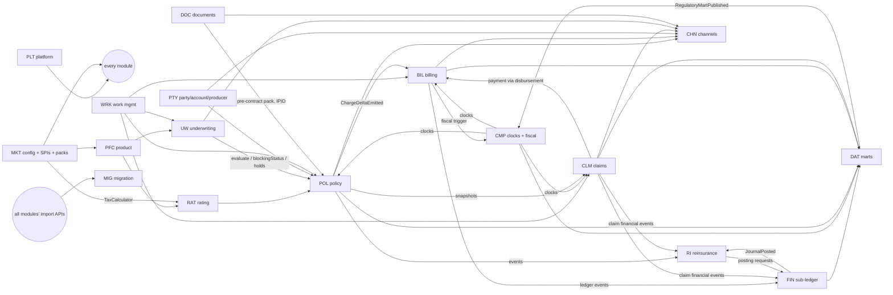

# PLAN — Greek-market P&C core insurance system

**Status:** Phase 0 complete. **Awaiting approval before Phase 1.**
**Date:** 2026-10-07 · **Orchestrator memory:** PLAN.md, DECISIONS.md, STATUS.md (re-read at the start of every wave)
**Inputs read:** 18 PRDs, 3 programme documents (00-system-contract v1.11/1.12, 00-integration-review, 00-baseline-inventory),
the full Aegean design guide (parts 1–4, tokens, v3 mockup), and both infra specs. Reading was split across 26 reader agents,
and each one wrote a digest to `orchestration/digests/` (≈354k words). Every statement below cites a digest.

---

## 0. The one-paragraph picture

The PRD set is unusually mature. A binding system contract fixes the domain model, events, IDs and interface conventions,
and PRD-18 freezes a **Motor MVP cut**: every Must tagged P1, which is **3,710 requirements (5,614 size points)** across 17
modules. PRD-18 also sets the binding build order **W1–W9** (decision D9) and a 12-scenario end-to-end suite (E2E-01…12).
The infra specs pin the whole stack: .NET 10 modular monolith, PostgreSQL 17, Hangfire, outbox, React 19, Entra ID, Gotenberg and Azure.
**The main friction is that the PRDs were written for an older, heavier architecture.** They assume a message broker, a workflow
engine, a self-built identity server, a lakehouse, an in-house PDF engine and PostgreSQL 18. The infra specs explicitly
override that wording, so DECISIONS.md applies one consistent translation (§5.1 below). The other friction is
**regulatory values that are still UNVERIFIED** and gated on a commissioned legal opinion (D2). Those values are built as
pack configuration with a legal-status flag and never invented (DECISIONS D-REG-*).

**Scale warning:** this is a multi-year programme. 3,710 Musts at roughly 30–50 requirements per agent work package is
**about 90–110 build briefs plus the same number of reviews**. User chose: full cut, waves in order (Q2).

---

## 1. PRD inventory

Size: S < 40 Must, M 40–100, L > 100 or heavy money/temporal logic. "P1 Musts" is the Motor MVP cut (PRD-18 §16, after D6).

| PRD | Code | Purpose (one line) | Reqs (Must) | P1 Musts | Screens | Size | Notes |
|---|---|---|---|---|---|---|---|
| 01 | PTY | Parties/roles, identifiers (AFM), accounts, households, consent, sanctions, dedupe/merge, intermediaries, commission agreements, search | 266 (216) | 218 | 23 | **L** | Bitemporal party data, merge/unmerge, Greek/Latin search on 1.5M parties ≤ 1 s |
| 02 | PFC | Product as data: line→product→version, coverages, terms, question sets, charge types, compiled artefact plus configuration hash | 233 (206) | 200 | 20 | **L** | Deterministic compiler (RFC 8785 + SHA-256), in-house CEL-compatible expressions, version conversion |
| 03 | RAT | Pure deterministic rating: rates per element × charge type, worksheet, proration, taxes via TaxCalculator, golden tests, shadow runs | 256 (219) | 214 | ~6 | **L** | Zero-cent golden suites (≥ 2,000 motor cases); purity enforced by tests |
| 04 | UW | Underwriting rule sets (decision tables), issues/blocking points, referrals, authority at decision, policy holds, workbench | 268 (206) | 183 | 20 | **L** | Shares the CEL runtime; POL↔UW cycle broken via anchors/read models |
| 05 | POL | Policy, term, job, transaction; bitemporal segments; reverse-and-reapply out-of-sequence handling; quote/bind/issue; cancel/reinstate/renew | 345 (300) | 293 | 21 | **L** | Hardest temporal logic in the programme |
| 06 | BIL | Billing accounts, plans, invoices (non-fiscal), payments/allocation, SEPA, delinquency, refunds, commission, disbursement engine, append-only ledger | 349 (307) | 294 | 17 | **L** | Double-entry ledger, 74 BRs, worked example = golden test |
| 07 | CLM | FNOL, claim/exposure, reserves/payments/recoveries, Greek motor clocks, Friendly Settlement, fraud rules, claim search | 248 (197) | 193 | 20 | **L** | Claim financial engine; FS clearing via BIL (D1) |
| 08 | RI | Treaty registry, motor XoL recoveries, aggregates, IFRS 17 RI-held data, settlement via BIL | 240 (179) | 91 | ~10 | **M** | Proportional cession is P2 (assumes motor is XoL-only, A-01) |
| 09 | FIN | Multi-book posting engine (LOCAL_GAAP/IFRS17/SII), earning, IFRS 17 PAA, tax/levy accounting, reconciliations, close, GL extract | 290 (256) | 242 | 14 | **L** | Append-only sub-ledger; IFRS 17 policy elections still open |
| 10 | DOC | Templates/clauses, rendering (PDF/A), immutable archive, delivery with statutory proof, IPID/cover note, batch output | 305 (255) | 250 | 17 | **L** | Gotenberg gap analysis needed (PDF/A-3a, byte-reproducible output, sealing) |
| 11 | CMP | Fiscal channel (myDATA), Information Centre, statutory clock register, complaints, DSAR orchestration, AI register, regulatory submissions | 245 (209) | 183 | 11 | **L** | ~2M live clocks, so a scanner design is needed, not a job per clock |
| 12 | CHN | Customer portal/app, broker portal, partner APIs plus webhooks, developer portal, MCP facade (off), permission matrix | 288 (217) | 212 | 32 | **L** | Bancassurance is out of P1 (D6); the mobile app stack is undecided (Q3) |
| 13 | WRK | Activities/queues/routing, SLA timers, inbound documents, global search, notifications, My Desktop | 313 (235) | 231 | 26 | **L** | Every module depends on it from W2 |
| 14 | PLT | Identity, RBAC/ABAC, authority framework, maker-checker, audit, outbox/events, config runtime, numbering, time, observability, DORA, AI control plane | 352 (298) | 283 | 28 | **L** | Re-scoped onto Entra ID (DECISIONS D-ARC-03) |
| 15 | DAT | Report marts (raw/conformed/mart), regulatory marts (SII, A.1004, EAEE, IPT, Fairfax USD), model registry, data quality/lineage | 283 (225) | 212 | 18 | **L** | Lakehouse becomes PostgreSQL `rpt_*`; change data capture is replaced (D-ARC-06) |
| 16 | MIG | Migration/coexistence: import contract, cross-reference, routing, mapping, reconciliation, rehearsal, rollback | 192 (172) | 167 | 10 | **L** | Scenario B assumed; synthetic legacy simulator only |
| 17 | MKT | Six-layer configuration, SPI catalogue (40), pack lifecycle, capability switches, i18n/l10n, GR pack, CY stub, golden suite | 324 (274) | 244 | 12 | **L** | Foundational: every module calls the configuration and SPIs |
| 18 | XMR | Programme baseline: MVP cut, waves W1–W9, E2E-01…12, open questions, decision log, canonical state models/glossary of record (D5) | n/a | XMR-FR-250 | — | **cross-cutting** | Owned by the orchestrator; drives Phase 3, not a feature module |

Totals: about 4,697 requirement rows, 3,785 Musts, **3,710 Must P1**, 302 events, 324 screens, 119 AI features (all
default **off**; none needed for MVP).

---

## 2. Dependency graph

The PRD dependency columns contain cycles: 781 of the 4,890 Must→Must links point forward, and 249 of the 314 capability
groups sit in one cycle (PRD-18 F-360). The build order therefore comes from the architecture. Forward links are met
**interface-first**: the owner publishes its operation, event schema, contract test and sandbox double before the
consuming wave starts.

Critical anchor chains (PRD-18 §16.7):
- **Quote:** MKT-001 config → PFC-001 resolve → RAT-001 rate → POL-011 quote; MKT-087 TaxCalculator → RAT-009 → POL-011.
- **Bind:** PFC-001 → UW-001 evaluate → UW-002 blocking status → POL-003 bind gates (+ PTY-006 screening, PTY-008 producer, BIL-003 down payment, DOC-007 pre-contract pack).
- **Money:** POL-005 ChargeDeltaEmitted → BIL-002 charge intake → BIL-011 → FIN-001 posting; BIL-096 fiscal trigger → CMP-001 fiscal channel (MKT-088 FiscalDocumentChannel).
- **Lifecycle:** MKT-009 clock values → CMP-003 clocks → BIL-006 non-payment → POL-012 cancellation → BIL-007 refunds.
- **Claims:** CLM-001 FNOL → CLM-003 financials → CLM-004 payment → BIL-009 disbursement; CLM-005 events → RI-003 and FIN-001.

Known two-way pairs and how each cycle is broken in code: POL↔UW (UW only changes POL through dry-run-first POL commands
plus events; POL calls only `evaluate`, `blockingStatus` and `PolicyHold.check`), POL↔RAT (POL calls RAT; RAT never calls POL),
RI↔FIN (events in both directions, with no synchronous call back), CMP↔DAT (events only). Each module references only the
other's `*.Contracts` project; NetArchTest forbids implementation references.

---

## 3. Build waves

Binding baseline: PRD-18 §16.3 (accepted by D9). Waves are **capability waves**: one module can appear in several waves
(for example, POL quote and bind in W4, then change, cancel and renew in W6).

| Wave | Name | P1 Musts | Points | Modules (Musts) | Ends with E2E |
|---|---|---|---|---|---|
| **Phase 1** | Foundations (orchestrator-owned) | — | — | Scaffold, CI, shared kernel, contracts, design system, Greek cross-cutting | Build and architecture tests green |
| W1 | Platform and configuration | 481 | 678 | PLT 241, MKT 240 | E2E-12 harness, golden-suite harness |
| W2 | Masters and shared services | 806 | 1,190 | WRK 231, PFC 199, DOC 187, PTY 161, CMP 28 (clocks) | — |
| W3 | Pricing and underwriting | 361 | 519 | RAT 188, UW 173 | — |
| W4 | Policy core and quote-to-bind | 340 | 550 | POL 206, CHN 95, DOC 39 | quote and bind portion of E2E-01 |
| W5 | Money: billing, fiscal, posting | 400 | 590 | BIL 224, FIN 121, CMP 55 | **E2E-01** |
| W6 | Servicing, renewal, distribution money | 314 | 493 | POL 86, CHN 77, BIL 60, PTY 56, DOC 24, UW 10, PFC 1 | E2E-03, -04, -07, -08, -11 (partial) |
| W7 | Claims and RI recoveries | 285 | 488 | CLM 192, RI 77, BIL 9, CHN 7 | E2E-02, -06, -11 |
| W8 | Close, reporting, compliance, analytics, AI control plane | 532 | 741 | DAT 208, FIN 120, CMP 99, PLT 36, CHN 33, RAT 20, RI 13, MKT 3 | E2E-09, -10 |
| W9 | Migration and cut-over | 191 | 365 | MIG 167 + 24 import anchors | E2E-05; full regression |

**Parallelism inside a wave.** The concurrency cap is 4 builder agents, each in its own git worktree. A wave is split into
**work packages (WPs)** of about 30–50 Musts along the PRD capability groups (§16.5), so that each WP fits one agent session
with room to test. Running order within a wave: WPs that publish interfaces go first; the rest follow in parallel. Rough WP counts:
W1 ≈ 12, W2 ≈ 20, W3 ≈ 9, W4 ≈ 9, W5 ≈ 10, W6 ≈ 8, W7 ≈ 7, W8 ≈ 13, W9 ≈ 5, which is **≈ 93 WPs**.

**Special rules (from PRD-18 §16.3):**
- The migration import APIs (REQ-POL-013, BIL-012, CLM-010, FIN-010, PTY-013, RI-007, CMP-009, MKT-010) are built in their
  owner's wave and must be **callable from W5**.
- AI features and the PLT AI control plane are W8. No earlier Must depends on AI. All AI is shipped `Ai__Enabled=false`.
- Where a module needs another module that comes later in the build, it consumes a **contract-test sandbox double**
  (WireMock for HTTP, a fake publisher for events) generated from the Phase 1 contracts.

**Gate between waves:** every WP passes independent review, then the full suite runs (unit, integration on Testcontainers,
contract, architecture, golden, Playwright E2E for the scenarios ending in that wave), then the merge to `main`. A WP that fails review three times escalates to the user.

---

## 4. Shared contracts (Phase 1, orchestrator-owned; feature agents may not redefine)

### 4.1 Canonical domain model (`CoreIns.SharedKernel` + each module's `*.Contracts`)
Source: contract §3.2 (entity catalogue, identifiers, state models), with PRD-18 §9 as the state models of record (D5).

- **Value types (SharedKernel):** `Money` (decimal + ISO currency, with explicit rounding from configuration), `Currency`,
  `Percentage`/`Rate` (decimal, 4 dp for rates), `DateRange` (**half-open [start, end)**, D5), `BusinessDate`,
  `Bitemporal<T>` (valid time + transaction time), `LegalEntityId`, `ConfigurationHash`, `ResolutionHash`, `IdempotencyKey`,
  `CorrelationId` (W3C trace, technical only) and `BusinessKey` lineage (D5), `Afm`, `Iban`, `LocalizedText` (el, en).
- **Strongly typed IDs** for every entity (one record struct per ID) in the formats of contract §3.2.3 / §3.6.1.
- **Entities by owner** (each one is defined only in its owner's Contracts project; other modules hold its ID and snapshots):
  - PTY: Party, PartyRole, Account, Household, Consent, Intermediary/ProducerCode, CommissionAgreement
  - PFC: ProductLine, Product, ProductVersion, CoverageDef, ChargeType, QuestionSet
  - RAT: RatingRequest/Result, Worksheet, RateTable
  - UW: UwIssue, Referral, PolicyHold
  - POL: Policy, PolicyTerm, Job, PolicyTransaction, Segment, Quote, Coverage (instance), ChargeDelta
  - BIL: BillingAccount, PaymentPlan, Invoice, Payment, PaymentInstrument (**the only bank-account record**, R-38), Refund, Disbursement
  - CLM: Claim, Exposure, Claimant, ReserveLine, ClaimTransactionSet, ClaimPayment, Recovery, FsCase
  - RI: Programme, Contract, Layer, Participation, Cession, RiRecovery
  - FIN: Book, Journal, JournalLine, GlAccount (namespaced away from PTY Account), Period, Ifrs17Group
  - DOC: Template, Clause, DocumentType, Document, Delivery
  - CMP: StatutoryClock, FiscalDocument, Complaint, Dsar, Obligation, AiSystem
  - WRK: Activity, Queue, Group, InboundDocument
  - PLT: User/Profile (on top of Entra), Role, AuthorityGrant, ApprovalRequest, AuditEvent, OutboxMessage
  - MKT: ConfigKey/Binding, Pack, CapabilitySwitch, CodeList
- **State machines** (contract §3.2.4 + PRD-18 §9) as declarative transition tables in the Contracts projects, enforced in
  the domain and by check constraints: Quote, Job, PolicyTerm, PolicyTransaction, Invoice, Payment, Refund, Claim, Exposure,
  Reserve, ClaimPayment, StatutoryClock (DEADLINE / WAITING_PERIOD / FIXED_DATE), ProductVersion, Pack, Activity, Document.
- Name collisions get namespaced: `Pty.Account` vs `Fin.GlAccount`, `Clm.Recovery` vs `Ri.RiRecovery`, and the two
  meanings each of Reinstatement and Submission.

### 4.2 API conventions (contract §3.5)
- REST + OpenAPI 3.1 generated from ASP.NET Core controllers; `/api/{module}/v{major}/...`; one OpenAPI document per module
  plus a merged one; the TypeScript client is generated by `openapi-typescript`.
- Every state-changing call needs an `Idempotency-Key` header (stored in `plt.idempotency_record`). `?dryRun=true` is
  supported where the contract requires it.
- Errors are RFC 9457 Problem Details with a stable `type` URI per error, a `code` (`<MOD>-<NNN>`) and a localized `title`.
- Pagination is cursor-based; filtering uses a documented query grammar; time travel uses `asOf` (valid time) and `knownAt`
  (transaction time) on bitemporal reads.
- Security: Entra bearer tokens; app roles map to permissions; authority checks go through `plt.Authority.check`; every
  request carries `traceparent`.
- One module calls another **in-process through the other's `*.Contracts` interface**, never over HTTP and never against
  its tables. HTTP is only for UI, partners and tests.

### 4.3 Event schema (contract §3.4)
- The envelope (one C# record plus a JSON Schema) carries: `eventId`, `eventType`, `schemaVersion`, `producer` (module),
  `aggregateType`, `aggregateId`, `aggregateSequence` (gap-free per aggregate), `occurredAt`, `recordedAt`, `legalEntity`,
  `configurationHash`, `businessKeys` (lineage, D5), `correlationId` (trace), `causationId`, `origin`
  (`LIVE|MIGRATION|REPLAY`), `dataClassification`, `payload`.
- Transport: `plt.outbox_message` is written in the same transaction as the change. A dispatcher in the worker processes
  messages in aggregate order and hands them to in-process handlers. `plt.processed_event` gives idempotent consumers.
  There is a dead-letter table, a replay command, and an event archive (outbox retention is separate from the replay window).
- "Topic / partition key / consumer group / schema registry" in the PRDs maps to: event-type namespace / ordering key
  (`aggregateId`) / handler registration / the JSON Schemas in `contracts/events` checked in CI (D-ARC-02).
- The catalogue of record is PRD-18 §8 (302 events). Each event gets a JSON Schema and a C# record in Phase 1, and module
  PRDs' §8 supply the payload fields.

### 4.4 Auth, roles, authority
- Identity: **Entra ID** for staff and **Entra External ID** for customers, brokers and (later) bank staff. App roles come from
  the contract persona model §3.2.5. PLT keeps a `user_profile` (language preference R-101, legal entity, delegations), but
  no credentials (D-ARC-03).
- Authorisation: RBAC from app roles plus ABAC attributes (legal entity, channel, producer hierarchy, data class).
- Authority framework (CD-05): modules register authority types; `plt.Authority.check(actor, type, dimensions, objectRef,
  asAt)` returns `allow|refer|deny` + reason, limit, source grant, referral target and check ID (50 ms p95). Maker-checker uses
  the `ApprovalRequest` with SoD rules, and the maker is never routed their own approval.

### 4.5 Audit logging
- Insert-only `plt.audit_event` with: actor, role, authority used, object reference, before/after (JSON diff), reason,
  correlation and business keys, origin, legal entity and timestamp. Rows are hash-chained per partition, and a periodic export
  goes to immutable Blob (infra §9). The application role has no UPDATE/DELETE grants. Every command handler audits through one
  shared decorator.

### 4.6 Greek-market cross-cutting (Phase 1)
- **i18n:** react-i18next + `i18next-icu`, Greek (`el-GR`) default and English secondary; Greek is the language of record
  for documents (contract §3.9.10); CLDR formats through `Intl`; EUR is shown as `1.234,56 €`; dates as `dd/MM/yyyy`.
  Greek upper-casing has no accents (`toGreekUpper()`), and final sigma is handled.
- **Search and collation:** PostgreSQL `unaccent` + `pg_trgm` + an ICU `el-GR` non-deterministic collation for sorting.
  Greek folding and Greeklish variants come from the GR pack (`NameTransliterator`, REQ-MKT-091/178) and are applied at
  index and query time.
- **AFM:** the mod-11 validator lives in the GR pack `IdValidator`, with the PRD-01 test vectors (verified by the PTY reader).
- **GDPR:** data classification P0–P3 per field; field-level encryption plus searchable blind indexes for P2/P3 identifiers
  and IBANs (Key Vault keys); DSAR export and erasure hooks per module (CMP orchestrates); retention catalogue in PLT;
  synthetic data only outside production.
- **Regulatory values:** these come ONLY from the PRDs. They live in GR pack configuration with a `legalStatus`
  (`Settled|Unverified|Draft`). Production activation refuses non-Settled motor-path values (REQ-CMP-264,
  REQ-MKT-322); golden tests on those amounts are "guarded". See DECISIONS D-REG-*.

### 4.7 Design system (Phase 1)
- `web/src/design-system`: the Aegean tokens (`tokens/aegean.css`, generated and committed as-is, with no Python in CI),
  the 39 §4 components on **React Aria** primitives, the gradient-border primary button (option 17), the app shell from the
  v3 mockup, layout primitives, the §5 patterns (forms, wizard, data table, workbench, maker-checker approval, empty/loading/
  error states), and the Greek formatters (money, dates, amount in words, abbreviations).
- Feature agents consume it and do not restyle. Stylelint rejects raw colours and off-token values.

---

## 5. Conflicts, gaps and ambiguities found

### 5.1 PRDs vs infra (infra wins — ARCHITECTURE-DECISIONS.md "overrides any older wording")
| # | PRD assumption | Where | Resolution (DECISIONS) |
|---|---|---|---|
| C-01 | Message broker: topics, partitions, consumer groups, schema registry, 30-day stream retention, ≥2,000 ev/s | contract §3.4, D10, every PRD §8, NFR-* | Outbox + in-process dispatch + event archive + JSON Schema checks in CI; early load test. D-ARC-02 |
| C-02 | Workflow engine ("PLT workflow engine", durable timers, sagas) | PLT-007/165–177, CD-07, PFC, BIL-163, CMP, WRK-090, DOC-175, MIG, FIN | Domain state machines + deadline tables + Hangfire **recurring scanners** (not one job per clock). D-ARC-04 |
| C-03 | Self-built identity server (two realms, passkeys, DPoP, SCIM, token exchange) | PLT-030–073, CD-20, CHN | Entra ID / External ID; PLT keeps profile and authorisation. Unsupported OAuth features are recorded as deviations. D-ARC-03 |
| C-04 | Lakehouse (bronze/silver/gold, open columnar tables, feature store) | DAT-067/068/079/289, contract, RI/RAT exports, `LakehouseErasure*` | `rpt_raw` / `rpt_conformed` / `rpt_mart` in PostgreSQL; names keep the "Lakehouse" token only as an alias. D-ARC-06 |
| C-05 | CDC reading every module's tables | DAT-050–057 | Replaced by producer control totals + outbox events (ADR rule 8 forbids reading other modules' tables). D-ARC-06 |
| C-06 | In-house rendering engine | DOC-155, CD-20 | In-house template→HTML composer + Gotenberg as the paginator + .NET post-processing; Phase 1 spike for PDF/A-3a, determinism and sealing. D-ARC-07 |
| C-07 | PostgreSQL 18 (`WITHOUT OVERLAPS`, `PERIOD` FKs, `uuidv7()`) | REQ-POL-079, NFR-POL-020 | PG17 + `btree_gist` exclusion constraints + trigger-checked period FKs + app-generated UUIDv7. D-ARC-05 |
| C-08 | RPO 5 min / RTO 2 h, 99.9% tiers, multi-region, stamps per module | contract §3.9.6, RAT, CHN, DOC | Infra Stage 2 targets (15 min / 4 h, one EU region) apply; PRD NFRs are recorded as production-hardening deltas. D-ARC-08 |
| C-09 | Kubernetes, self-run monitoring/SIEM | PLT | Container Apps + Azure Monitor; Sentinel in Stage 2. D-ARC-01 |
| C-10 | Pseudonymised real-book copies outside production | MIG-079/181/182/204 | Synthetic data only (infra rule 12); full-volume rehearsals run inside the production stamp. D-ARC-09 |
| C-11 | Separate failure-domain adapter host / integration hub | PLT-153–164, CMP | Integration adapters run in the `worker` container. D-ARC-01 |
| C-12 | `react-intl` (FormatJS) in the design guide | design §11.7 | react-i18next + `i18next-icu`. D-FE-02 |
| C-13 | Container Apps built-in auth `/.auth/refresh` in the design guide | design §5.12, §11.10 | MSAL React (built-in auth stays as the outer gate only). D-FE-03 |
| C-14 | Self-hosted Git + CI inside the EU stamp for product authoring | PRD-02 NFR-PFC-021, OI-PFC-06 | User: in-app versioning in `pfc` (D-USR-02) |
| C-15 | Native-capable mobile app | PRD-12 | User: deferred; responsive web only (D-USR-01) |
| C-16 | OCR + malware scanning (Must even with AI off) | WRK-267, PLT-161 | User: Defender/ClamAV; no OCR in P1 (D-USR-03) |

### 5.2 Between PRDs / contract / design guide (orchestrator rulings in DECISIONS.md)
- **Correlation ID defined three ways** (trace vs quote-to-journal vs business keys) → D5: business keys for lineage, trace ID technical only. D-CON-01
- **State-model gaps:** PolicyTerm has no Voided/Rewritten/rescind; Job's Scheduled origin is unclear; clock kind FIXED_DATE is missing from R-78; CLM-072 means an exposure with a Breached clock can never close; PTY account starts Active vs Pending; unmerge does not restore prior status; MIG renewal-conversion end states. D-CON-02…08
- **Event gaps:** 119 consumer-list entries have no handler (R3-002); `origin` is missing from the envelope list; AiSystemStatusChanged and WithdrawalRequestReceived are not catalogued. D-CON-09
- **RefundDisbursed timing** (bank file accepted vs statement cleared) → this decides when POL's 30-day withdrawal refund clock stops. D-CON-10
- **RAT tax computed twice** (annual rate vs rounded prorated amount) → one rule: POL posts the tax computed on the prorated, rounded amount. D-CON-11
- **FIN LRC basis** contradicts golden fixture GF-02. D-CON-12
- **RI settlement in P1 with no way to propose or approve it** (REQ-RI-189/190 are P3). D-CON-13
- **Renewal job lead vs renewal-notice lead** (both 45 days). D-CON-14
- **Design guide stale vs v3** (solid-blue CTA remnants in Parts 3–4; checkbox hover token; split-button divider; MI-67 sheen; count-up vs "no ticker on first render" for money). D-FE-04…06
- **Design guide inner inconsistencies:** table header 36 vs 38 px; 2-line row heights have no token; the mockup upper-cases with accents; hard-coded colours. D-FE-07
- **Baseline inventory:** user search has two owners (PLT and WRK); three FNOL entry points; some consumer cells are garbled. D-CON-15
- **Infra Stage 1 sizing vs PRD performance targets** (1 worker replica, Gotenberg 0–2). Performance NFRs are tested at Stage 2 sizing. D-ARC-08

### 5.3 Regulatory and tax gaps (never invented; logged as open in DECISIONS §OQ)
- **Settled and stated in the PRDs** (implementable): GR IPT classes 15% / 20% (PRD-17 GR pack), Auxiliary Fund 6% ceiling with a
  70/30 split (PRD-17; PRD-02/06 readings conflict, so OQ-010 stays open), MTPL minimums €1.3M BI per person / €1.3M PD
  per accident with HICP indexation, AFM mod-11, myDATA MARK before delivery (D3), the non-payment one-month waiting period,
  the MTPL offer at 3 months, payment at 10 days from proven offer delivery (D7), assessment at 15/25 days, repair at 20 days,
  the claims-history certificate at 15 days / 5 years, complaints at 50 days, distance withdrawal at 14 days with a full refund within 30
  days, the objection periods, A.1004 by 10 January, DORA reporting timers, the GDPR breach clock at 72 h.
- **UNVERIFIED / missing:** the stamp duty rate; IPT liability point (DUE pending); IPT/levy on credits and on withdrawal voids;
  levy refund on cancellation; fees in the IPT base; myDATA XSD version, document types and E3 codes (OQ-012); the
  Information Centre channel, format and deadline (OQ-017); 16 unverified clock values (OQ-008), including the 16-day MTPL third-party notice and the 15-day insurer termination;
  FS limits and reply window (OQ-018); statutory interest; nat-cat refusal regime; Law 2496/1997 UW windows; EIOPA
  taxonomy template set; A.1004/EAEE/BoG layouts; retention durations; proof media for notices (OQ-001b);
  cover-note legality (OQ-014); renewal lead value (OQ-004). All of these are **go-live gates owned by the D2 legal opinion**.
  They do **not** block the build: the system is built to the stated structure with `legalStatus=Unverified` placeholders
  that refuse production activation.

### 5.4 Things that cannot be built without a choice the infra does not pin → see the open questions below.

---

## 6. Phase plan after approval

1. **Phase 1 (sequential, orchestrator-owned, executed by briefed agents and reviewed before merge):**
   1a scaffold + CI + test harness (per infra §7, compose, Bicep skeleton, GitHub Actions) →
   1b SharedKernel + platform primitives (outbox, audit, idempotency, Problem Details, time service, authority-check
   interface, configuration-resolve interface, NetArchTest rules) →
   1c contracts: per-module `*.Contracts` projects, OpenAPI skeletons for all cross-module operations, JSON Schemas for 302
   events, contract-test harness + sandbox doubles →
   1d design system + app shell + i18n + Greek formatters →
   1e Greek cross-cutting: GR/CY pack skeletons, AFM `IdValidator`, search/collation, field encryption, data classification →
   1f spikes: Gotenberg PDF/A-3a determinism; outbox throughput (target ≥ 2,000 ev/s); CEL-subset evaluator.
2. **Phase 2:** W1 … W9 as in §3, at most 4 concurrent builders in worktrees, using the brief template in the original instruction.
3. **Phase 3:** an independent reviewer per WP, then the full suite plus the E2E scenarios ending in that wave, merging only on green.
