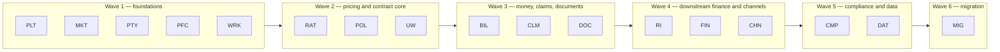

# Digest — 00 System Contract (binding cross-PRD contract)

**Source:** `core-insurance-prds/00-system-contract.md`, version **1.11** (2026-10-07), status "Binding on all PRD-01 … PRD-17 authors", owner: lead architect / design authority. Read in full (lines 1–1401, EOF).
**Digest structure:** adapted per orchestrator brief (sections A–K instead of the template's 1–15). Section references (§) are to the contract. "R-nn" = contract ruling (§3.10), "D1–D10" = programme decisions (§3.10.10), "CD-nn" = orchestration decision (§0).

**Precedence notes stated by the source:**
- Contract beats the prompt pack on structure, identifiers, ownership, vocabulary (preamble). PRD authors may not change it; changes only via CCR → design authority (§3.10).
- Rulings in §3.10 "take precedence over any earlier text in this contract that they amend" (§3.10.1 preamble).
- Several "records of" are **delegated to PRD-18** (D5): glossary of record = PRD-18 §6; event catalogue of record = PRD-18 §8; canonical models of Quote, PolicyTransaction, Reserve, Refund = PRD-18 §9; bitemporal/interval convention = XMR-FR-150. Event consumers: each producing PRD's §8 is authoritative (R-87). **This digest therefore cannot be fully self-sufficient for those four state models or for events added by rulings (payloads live in module PRDs).**
- For us, `ARCHITECTURE-DECISIONS.md` overrides PRD wording on technology (see K).

---

## A. Orchestration decisions (§0)

| ID | Decision (one line) |
|---|---|
| CD-01 | PRD structure = 16 sections of §3.11; pack's 23 sections mapped into mandatory subsections. |
| CD-02 | IDs: `REQ-<MOD>-<NNN>` (functional), `BR-<MOD>-<NNN>`, `NFR-<MOD>-<NNN>`; pack form `PTY-FR-042` not used (`REQ-`≙`-FR-`, `BR-`≙`-BR-`, `NFR-`≙`-NFR-`). |
| CD-03 | `REQ-<MOD>-001…029` reserved for contract anchors (§3.6.3); owner must define each listed anchor with exact ID/meaning; unlisted numbers in 001–029 stay unused; module reqs start at 030. |
| CD-04 | **Account** (commercial container, households, account holder) owned by **PTY**; **POL** owns Policy, PolicyTerm, Job, PolicyTransaction, Segment and references Account. |
| CD-05 | **Authority framework** (profiles, limits, grants, delegation, `authority.check`) owned by **PLT**; UW, CLM, BIL, FIN, RAT etc. register authority types and call the check; UW owns *what* needs UW authority and the authority-at-decision UX. |
| CD-06 | Configuration: **MKT** owns model (six layers, key types, merge, effective dating, approval, configuration hash, explorer) and business **capability switches**; **PLT** owns runtime hosting and **feature flags** (technical/release). |
| CD-07 | Statutory clocks: **CMP** owns clock-definition register, instances, dashboard; MKT packs supply durations/calendars via `StatutoryClockSet`; POL, BIL, CLM, CMP-complaints, UW start/stop via `REQ-CMP-003`; PLT provides workflow engine; WRK turns warnings into activities; a module timing a deadline in its own workflow (e.g. DORA timers in PLT) owns it, CMP mirrors read-only (R-61). |
| CD-08 | Regulatory mappings: **MKT** owns regime code lists (SII LoB, BoG classes, IPT classes, IFRS 17 portfolio scheme) by taxonomy version; **PFC** owns coverage-grain assignment per product version; **DAT** owns taxonomy-version transforms and treaty-type → RI line mapping. |
| CD-09 | **DOC** owns outbound docs, templates, clauses, form patterns, binding matrix, immutable archive, unified Documents tab; **WRK** owns inbound intake/classification/extraction/verification and stores binaries via DOC archive API. |
| CD-10 | Groups, queues, work assignment → **WRK**; users, roles, permissions, access reviews, identity → **PLT**. |
| CD-11 | AI governance split: **PLT** AI control plane (EU model gateway, toggles, kill switch, AI interaction audit); **DAT** model registry, monitoring, drift, bias; **CMP** AI system register (AI Act class, transparency); each module owns its AI features per §3.8. |
| CD-12 | Sanctions screening owned by **PTY** (engine, lists, hit review); POL (bind), BIL (refund), CLM (payment) call `REQ-PTY-006`; CMP consumes as evidence. |
| CD-13 | Payment execution (disbursement files, payee verification/VoP, bank formats) owned by **BIL**; CLM creates claim payments as claim financial transactions and requests disbursement via `REQ-BIL-009`. |
| CD-14 | Commission: **PTY** owns agreements (versioned data); **BIL** calculation, statements, payment runs; **FIN** expense/payable postings. |
| CD-15 | **BIL** owns billing sub-ledger (receivables, cash, suspense, commission payable at txn level); **FIN** owns books (LOCAL_GAAP, IFRS17, SOLVENCY_II) posted from billing business events; reconciled **daily**, no shared tables. |
| CD-16 | Wave order (§3.1.3) derived from dependencies; tightly coupled pairs share a wave and cite each other via anchors. |
| CD-17 | Holidays, calendars, currencies, FX rates = reference data owned by **PLT**; MKT packs supply holiday content and rounding rules as data. |
| CD-18 | Entity search belongs to entity owner (party/account → PTY, policy → POL, claim → CLM); **global search, recent items, command palette back-end → WRK**. |
| CD-19 | Each PRD ≥ 120 functional reqs, every Must with Given/When/Then, typically 15–25k words. |
| CD-20 | Built from scratch in code, vendor-neutral: PRDs must not name OutSystems, low-code, cloud provider services, identity provider products, managed workflow/eventing/lakehouse products, document engines; capabilities named generically ("event stream", "workflow engine", "identity service (custom-built, owned by PLT)", "lakehouse", "key-management service", "rendering engine"). Open standards (OIDC, OAuth 2.1, OpenTelemetry, SEPA ISO 20022, PDF/A, ACORD, MCP) and government/market services (AADE myDATA, gov.gr, EAEE) may be named. |

---

## B. Module map, dependencies, build waves (§3.1)

### B.1 Architecture context stated in §3.1.1 (verbatim intent; several items conflict with ADR — see K)
Modular monolith, one PostgreSQL schema per module, in-process interfaces + published events; transactional outbox → "an event stream"; "a workflow engine for long-running processes and statutory clocks"; custom-coded front ends, **no business logic in front ends**; "a read-side lakehouse" for reporting/actuarial/regulatory marts; built from scratch (CD-20); bitemporal policy stack with reverse-and-reapply; immutable double-entry ledgers; product-as-data with deterministic rating; **charges are the only bridge from policy to money**; country packs behind typed SPIs; config layered core → group → region:EU → country → legal entity → product/channel; EU region, **one deployment stamp per regulated legal entity**; "core language Kotlin or .NET" (D10 later fixes .NET); custom-built identity service (PLT); delivery Greek private motor → home → commercial property & liability; owning group **Fairfax (USD group reporting)**.

### B.2 Modules (§3.1.1–3.1.2)

| PRD | Code | Title | Scope (one line) | Depends on | Depended on by |
|---|---|---|---|---|---|
| 01 | PTY | Party, customer and distribution | Persons/orgs vs roles, identifiers, contacts/addresses (native+Latin), **accounts**, households, consent/preferences, vulnerable flags, **sanctions**, dedupe/merge, intermediaries/producer codes/licences/CPD, producer of record, **commission agreements**, party/account search | PLT, MKT, WRK, DOC (archive), CMP (DSAR) | every business module |
| 02 | PFC | Product factory and configuration | Product-as-data: line→product→version lifecycle, element/risk-unit types, coverages/terms/options/offerings, question sets, charge types, refs (rating, UW rules, forms, plans, refund method, day-count, OOS rule), coverage-grain regulatory mapping, POG, renewal conversion, compiled artefact + hash, diff/impact | PLT, MKT | RAT, UW, POL, BIL, CLM, DOC, CHN, DAT, MIG |
| 03 | RAT | Rating and pricing engine | Pure deterministic rating (artefact hash + normalised input → annual rates per element × charge type per segment + worksheet; **rates not amounts**), proration/day-count shared with POL, taxes via `TaxCalculator` as separate charge types, rate tables as data, deviations within authority, rate mgmt (golden tests, shadow runs, impact), explainability | PFC, PLT, MKT, DAT (impact data) | POL, UW, CHN, MIG, DAT |
| 04 | UW | Underwriting and referral workbench | UW rule sets as versioned decision tables, issue lifecycle by blocking point, UW authority types (on PLT), referral routing/SLA on WRK queues, workbench, commercial intake, external reports, inspections, declines + Greek refusal docs, contingencies, renewal UW, **policy holds**, accumulation at bind | PTY, PFC, RAT, POL (anchors), WRK, PLT, DOC, RI/DAT | POL, CHN, RAT |
| 05 | POL | Policy administration and transaction engine | Policies, terms, jobs (submission, change, cancellation, reinstatement, rewrite, renewal), transactions, concurrency/preemption/rebase, **bitemporal stack, segments, reverse-and-reapply**, status model, quotes, bind/issue gates, cancellations, renewal, risk data, policy search, wizards, Greek lifecycle via clocks | PTY, PFC, RAT, UW, WRK, PLT, MKT, DOC, BIL (bind gate), CMP (clocks) | UW, BIL, CLM, RI, FIN, DOC, CMP, CHN, DAT, MIG |
| 06 | BIL | Billing and collections | Billing accounts (payer ≠ policyholder), plans + down-payment bind gate, charge scheduling, invoices (non-fiscal), payment methods, receipts/allocation/suspense, reversals, delinquency→non-payment notice→cancellation request, refunds, write-offs, agency bill, **commission calc/payment runs**, levy payables, bank rec, **disbursement infra (shared with CLM)**, billing sub-ledger | PTY, POL, PFC, PLT, MKT, CMP, DOC, WRK | POL, CLM, FIN, CHN, CMP, DAT, MIG |
| 07 | CLM | Claims management | FNOL (incl. joint accident report), coverage verification on POL snapshots, claim/exposures/claimants/incidents, financials (reserves, payments, recoveries, sets, voids, stops), recoveries (subrogation, salvage, FS, Auxiliary Fund, Green Card), offer clock, vendors, litigation, cat events, fraud/SIU, claims-history certificate, claim search | PTY, POL, PFC, WRK, BIL, DOC, CMP, PLT, MKT | RI, FIN, CHN, CMP, DAT, MIG |
| 08 | RI | Ceded reinsurance | Programmes/contracts/sections/layers/participations, proportional cession per risk per segment, XoL recoveries, reinstatement/deposit/sliding/profit commissions, fac, bordereaux/SOA/cash calls/settlements/collateral, accumulation, IFRS 17 RI-held, multi-currency (assumed RI later) | POL, CLM, PTY, FIN (anchors), PLT, DAT | FIN, UW, DAT, CMP, MIG |
| 09 | FIN | Finance sub-ledger and accounting | Posting engine per book (LOCAL_GAAP/IFRS17/SOLVENCY_II), immutable journals, CoA/mappings, earning from segments, DAC, IFRS 17 groups/PAA/onerous/RI-held, SII views, tax/levy accounting + returns, myDATA rec, commission expense, RI entries, FX reval + USD, manual journals, close, reconciliation, GL extract, actuarial intake | BIL, CLM, RI (anchors), POL, PFC, PLT, MKT, DAT | CMP, DAT, RI, MIG |
| 10 | DOC | Documents and communications | Templates/clauses (Greek binding master), form patterns + binding matrix, payloads, **rendering engine built from scratch** (incl. batch), doc-type catalogue, immutable archive (hash, retention, legal hold, as-of re-render), delivery with statutory proof, e-signature (gov.gr), IPID / provisional proof of cover, Documents tab | PFC, POL, PTY, CMP, PLT, MKT | POL, UW, BIL, CLM, CMP, CHN, WRK, MIG |
| 11 | CMP | Regulatory compliance and reporting | Fiscal channel (myDATA, e-invoicing), Information Centre adapter, A.1004/ENFIA/EAEE, **statutory clock register**, complaints, DSAR orchestration, obligations register, **AI system register**, regulatory change backlog, submission tracker, hand-offs to DAT (QRT) and PLT (DORA) | POL, BIL, CLM, FIN, PTY, DOC, PLT, MKT, DAT | POL, BIL, CLM, FIN, DAT, CHN, MIG, every module |
| 12 | CHN | Channels | Customer portal/mobile, broker/agent portal, bank journeys/bancassurance APIs, partner APIs (ACORD NGDS) with webhooks/sandbox, comparison sites, **MCP AI agent facade**, transaction-permission matrix, external identity journeys, gov.gr Wallet pre-fill, accessibility/localisation | PTY, PFC, RAT, UW, POL, BIL, CLM, DOC, WRK, PLT, MKT, CMP | MIG, DAT |
| 13 | WRK | Work management | Activity patterns/activities on any object, groups/queues/assignment, diary, delegation, back-office requests, notes, **inbound documents**, **global search/recent/command palette**, notifications, SLA/escalation, My Desktop | PLT, MKT, DOC (archive) | every business module |
| 14 | PLT | Platform | Identity (staff + external), RBAC+ABAC, SoD, **authority framework + maker-checker**, audit trail, event infra (outbox, relay, topics, schema registry, replay, DLQ), integration hub, workflow engine + rules runtime, config runtime + feature flags, reference data, **numbering**, observability, release/change, stamps, security, data-protection services, **DORA ops**, **AI control plane**, admin tools (incl. non-prod system clock) | MKT | every module |
| 15 | DAT | Data, analytics, regulatory marts | Ingestion (events, CDC), bronze/silver/gold, data contracts, bitemporal analytical models, regulatory marts (SII, BoG, A.1004, IPT, EAEE, Fairfax USD), taxonomy transforms, actuarial supply/return via FIN, analytics/feature store, **model registry/monitoring/bias**, cat accumulation, BI, DQ/lineage, synthetic data | every module, FIN, CMP, PLT, MKT | FIN, CMP, RAT, UW, RI, MIG |
| 16 | MIG | Migration and coexistence | Strategy per object, profiling/DQ, mapping specs, idempotent ETL **only via module import APIs**, party matching, renewal conversion, history conversion, coexistence routing, external hand-overs, reconciliation, rehearsals, rollback, legacy archive | all modules | none |
| 17 | MKT | Multi-market framework and country packs | Config model, SPI catalogue, pack lifecycle (sign, activate, rollback), capability switches, tenancy, i18n/l10n (four settings), currency/rounding, regime code lists, golden suite + **Cyprus stub pack in CI**, Greece pack, FoS/FoE | PLT (runtime) | every module |
| 18 | XMR | Programme Requirements Baseline (synthesis) | Synthesis; holds glossary/event catalogue/canonical models of record (D5), build sequence W1–W9 (D9) | — | — |

Out-of-scope lines per module are in §3.1.2; key ones: POL excludes accounts (PTY), money (BIL), fiscal/bureau (CMP); BIL excludes GL books (FIN) and fiscal transport (CMP); CLM excludes disbursement execution (BIL), cession calc (RI); RI excludes assumed RI/retro (later); FIN excludes corporate ERP; DAT excludes XBRL rendering (but D10 puts XBRL in CMP); CHN holds **no business logic**.

### B.3 Dependency graph (reproduced faithfully, §3.1.3)

| Wave | PRDs | Rationale (verbatim sense) |
|---|---|---|
| 1 | PLT, MKT, PTY, PFC, WRK | No business-module dependencies; every later module consumes them. |
| 2 | RAT, POL, UW | RAT depends on PFC; POL on PTY/PFC/RAT; UW on PTY/PFC/RAT/WRK. POL↔UW and POL↔RAT mutually dependent (bind gates, referral signals, proration) — written together via anchors (CD-03). |
| 3 | BIL, CLM, DOC | Each depends on POL and wave-1. CLM depends on BIL disbursement anchor `REQ-BIL-009` (same wave). |
| 4 | RI, FIN, CHN | RI needs POL charge deltas + CLM financial events; FIN needs BIL, CLM, RI (RI↔FIN cycle via anchors); CHN needs PTY, UW, POL, BIL, CLM. |
| 5 | CMP, DAT | CMP depends on POL, BIL, CLM, FIN; DAT on all; CMP↔DAT via anchors. |
| 6 | MIG | Depends on every module's import API. |

**Important:** these are the *PRD-writing* waves. D9 states the **build sequence W1–W9 of PRD-18 §16 is the planning baseline**, "recomputed after the column split" (Requires / Used by). The W1–W9 content is not in this file. Note also that the stated dependencies contradict the wave order in places (e.g., PTY in W1 depends on DOC (W3) and CMP (W5); POL (W2) depends on BIL/DOC/CMP anchors) — resolved by anchors, but a build plan must stub them.

---

## C. Canonical domain model (§3.2)

### C.1 Rules (§3.2.1, amended by R-09, R-01)
1. **One owner per entity**; only owner defines attributes/states/invariants (its §7); others reference by name + identifier and cite owner's REQ.
2. **No shared tables**; cross-module data via owner API or events. Consumer projections must be named `<Entity>View` and declare which events keep them current.
3. **Every business row carries** `legal_entity_id`, `jurisdiction` (ISO 3166-1 alpha-2; the jurisdiction whose rules apply — for contracts the risk location), optional `jurisdiction_subdivision` (ISO 3166-2) where a risk location is stored, `created_at`, `created_by`, `record_version`, and where business-valid `valid_from`/`valid_to`. Record time = system time of row version. Bitemporal entities say so explicitly. Home jurisdiction derived from `legal_entity_id` (R-09). Interval convention: **half-open `[valid_from, valid_to)`, UTC record time** (D5 / XMR-FR-150).
4. **Internal ids UUIDv7** (`<entity>_id`). **Business ids** via PLT numbering service (`REQ-PLT-014`) under `NumberingScheme` SPI (formats are pack data); business ids **never encode personal data**.
5. **Money** = `{amount: decimal(19,4), currency: ISO 4217}`; rounding per MKT currency rules (`REQ-MKT-006`). Multi-currency entities hold **transaction, functional, group (USD)** amounts with rate and rate source.
6. Names and addresses hold **native script and Latin** forms (PTY).
7. Personal-data class per attribute: `P0` not personal, `P1` personal, `P2` personal-sensitive (financial identifiers, national IDs, precise location), `P3` special category (health, criminal). Retention class per entity: PLT catalogue codes `RC-…`; any `RC-<MOD>-*` code defined in a PRD §7 joins the catalogue automatically (R-20; also R-10 `RC-PRODUCT-DEF`, `RC-PRODUCT-GOV`, `RC-PRODUCT-WORK`; R-19 `RC-PTY-*`).
- **R-01:** entities not in §3.2.2 that a PRD defines are private to that module; others reach them only via owner API.

### C.2 Entity catalogue (§3.2.2, full, plus cross-module-visible additions by rulings)

| Entity | Owner | Business identifier | Key attributes (outline) | Key relationships |
|---|---|---|---|---|
| Party | PTY | Party number | type (Person, Organisation); names native + Latin (ELOT 743) + "as on ID document"; birth date / incorporation; legal form; nationality; vulnerable flag; status; (R-31: organisation annual gross revenue by fiscal year with source/evidence) | has PartyIdentifier*, ContactPoint*, Address*, PartyRole*, Consent* |
| PartyIdentifier | PTY | — | scheme (AFM, DOY, GEMI, LEI, passport, national ID, TIC, EIK, VAT with EL prefix …), value, issuing country, verification status, evidence ref | Party |
| ContactPoint | PTY | — | type (phone, email, …), value, purpose, valid period, verified | Party |
| Address | PTY | — | type (legal, mailing, risk, garaging, billing), lines native + Latin, postcode, geocode ref, valid period | Party, Account location |
| PartyRole | PTY | — | role type (policyholder, insured, payer, driver, claimant, witness, beneficiary, loss payee, mortgagee, lessor, intermediary, reinsurer, RI broker, repairer, assessor, lawyer, medical provider, vendor); valid period | Party; contextual links owned by context module (PolicyParty in POL, Claimant in CLM) |
| PartyRelationship | PTY | — | type (spouse, dependant, parent company, director …), valid period | Party ↔ Party |
| Account | PTY (CD-04) | Account number | account holder party, type (personal, commercial), household members, status, preferred language, producer-of-record defaults | Party; Policies reference Account |
| Consent | PTY | — | purpose, channel, lawful basis, given/withdrawn timestamps, proof ref, durable-medium consent | Party |
| CommunicationPreference | PTY | — | purpose (policy docs, billing, claims, marketing), channel, language, paper/durable/website | Party |
| ScreeningResult | PTY | Screening case number | list, match score, status (Clear, PotentialHit, FalsePositive, TrueMatch), reviewer, payment block flag | Party |
| Intermediary | PTY | Intermediary code + Chamber register number | type (agent, broker, tied, ancillary, bancassurance partner — Greek types are pack data per R-14: agent, coordinator of agents, broker, ancillary), licence, CPD records, hierarchy parent | Party |
| ProducerCode | PTY | Producer code | intermediary, branch, effective period, status, authorities (collect premium, issue cover notes, bind) | Intermediary |
| ProducerOfRecord | PTY | — | policy term ref, producer code, valid period, change reason | ProducerCode, PolicyTerm (ref) |
| CommissionAgreement / Version | PTY | Agreement number + version | rates by product, channel, transaction type; overrides, splits, contingent and profit terms, chargeback rules | Intermediary, Product (ref) |
| Product / ProductVersion | PFC | Product code + version | line, jurisdiction, status (§3.2.4), effective period, artefact hash; event payloads carry rating-slot declaration (pinned/floating, compatible rating-artefact range, R-27) | has ElementType*, CoverageDef*, ChargeType*, QuestionSet*, Offering* |
| ElementType / FieldDef | PFC | Code | risk-unit type (vehicle, driver, building, location, contents, scheduled item), typed fields with GR/EN labels, validation, conditional visibility | ProductVersion |
| CoverageDef / CoverageTermDef / Option | PFC | Coverage code, term code | required/optional/suggested, existence rules, dependencies, limits/deductibles as options or ranges, statutory-minimum finals | ProductVersion |
| ExclusionDef / ConditionDef | PFC | Code | applicability, wording ref (DOC clause) | ProductVersion |
| Offering (package) | PFC | Code | selected coverages and default terms | ProductVersion |
| QuestionSet / Question | PFC | Code | type (pre-qualification, underwriting, offering), answers, conditional display | ProductVersion |
| ChargeType | PFC | Code | category (premium, tax, levy, fee, surcharge, discount, credit), proratable/flat, earning pattern, tax class, GL key, RI-cedable | ProductVersion |
| RegulatoryMapping | PFC (CD-08) | — | coverage → code per regime (SII LoB, IPT class, BoG class, IFRS 17 portfolio) | CoverageDef, MKT code lists |
| PogRecord | PFC | — | target market, distribution strategy, testing evidence, review dates | ProductVersion |
| ProductReferenceTable (R-01) | PFC | table code + version | key/value columns, effective period; read by RAT and UW | — |
| RatingArtifact / RateTable | RAT | Artefact hash; table code + version | algorithm version, tables, golden tests, activation schedule; state model per PRD-03 §7.3 (R-23) | ProductVersion (ref) |
| Worksheet | RAT | Worksheet id | step, element, inputs, table and version, lookup key, output, operator | PolicyTransaction (ref) |
| PricingModification | RAT | — | deviation type, amount/percentage, reason, authority ref | Quote/Job (ref) |
| RatingGovernanceBundle (R-82) | RAT | — | RAT's governance bundle (not "EvidencePack") | — |
| UWRuleSet / UWRule | UW | Rule code + version | checkpoint, condition (decision table), issue type, blocking point, authority type | ProductVersion (ref) |
| UWIssue | UW | — | issue type, blocking point, status (§3.2.4), approving user, conditions, validity rule | Job (ref) |
| Referral | UW | Referral number | priority score, SLA, assigned queue/user | UWIssue, Activity (WRK) |
| Decline / RefusalDocument | UW | Decline number | structured reasons (peril × asset class), document ref | Job (ref) |
| Contingency | UW | — | condition, due date, owner, consequence, status | PolicyTerm (ref) |
| PolicyHold | UW | Hold code | region/postcode/product/date range, job types blocked, issue type raised | — |
| Inspection / Valuation / ExternalReport | UW | — | order, provider, cost, result, expiry, consent ref | Job (ref) |
| IssueType, SubmissionIntake, RenewalDirection, DisclosureFinding, RefusalRegisterEntry (R-32) | UW | — | UW-owned, cross-module visible (attributes in PRD-04) | — |
| Policy | POL | Policy number | product, account ref, status | has PolicyTerm* |
| PolicyTerm | POL | Policy number + term number | period, status (§3.2.4), producer-of-record ref, payment plan ref; stores pinned rating artefact for the term (R-21) | Policy |
| Job | POL | Job number | type (Submission, PolicyChange, Cancellation, Reinstatement, Rewrite, Renewal), status (§3.2.4), effective date, quote versions | PolicyTerm |
| PolicyTransaction | POL | Transaction number | job, effective time, record time, sequence, reversal links, configuration hash, artefact hash; per R-21 stores **product artefact hash, rating artefact hash, resolution-manifest hash, configuration hash**; canonical model in PRD-18 §9 (D5) | Job, Segment* |
| Segment | POL | — | valid period, snapshot of risk tree, annual charge rates per element × charge type | PolicyTransaction |
| Risk units: Vehicle, Driver (PolicyDriver), Building, Location, ScheduledItem | POL | VIN/plate for vehicle | attributes per PFC ElementType | Segment; Driver links Party (PTY) |
| PolicyParty (named insured, additional insured, interested party: loss payee, mortgagee, lessor) | POL | — | role on policy, party ref | Party (PTY) |
| ChargeDelta | POL | — (Charge id UUIDv7) | element × charge type, net amount, period, transaction ref, correlation key; D4 completeness fields `set_id`, `set_size`, `index`; delta mode NET is a final core key P1–P2 | PolicyTransaction → BIL, RI, FIN |
| BillingAccount | BIL | Billing account number | payer party, policies, payment method, due-date preferences | Party (PTY), PolicyTerm (ref) |
| PaymentPlan (instance) | BIL | — | plan type from PFC-offered list, schedule, down payment | BillingAccount, PolicyTerm |
| Invoice / InvoiceItem | BIL | Invoice number | items from charges, due date, status (§3.2.4), fiscal document ref; **non-fiscal payment demand** (D3) | BillingAccount |
| Payment (incoming) | BIL | Receipt number | method, amount, reference, status (§3.2.4) | BillingAccount |
| Mandate | BIL | SEPA mandate reference | debtor IBAN (P2), signature date, status | BillingAccount |
| PaymentInstrument (R-38) | BIL | — | payee account: IBAN, holder name, VoP result and date, verification status, valid period, source/evidence — system of record for every payee bank account (refund and claim payees); CLM references by id; PTY holds only a pointer | — |
| Disbursement (outgoing payment) | BIL (CD-13) | Disbursement number | payee, method, amount, VoP result, sanctions result, status (§3.2.4); source enum includes refund, claim payment, `RI_SETTLEMENT`, `FS_CLEARING`, `CMP_REDRESS`, `TAX_REMITTANCE` (D1); payment method `CLEARING` added (D1) | Refund (BIL) or ClaimPayment (CLM) |
| Refund / WriteOff / SuspenseItem / Reversal | BIL | Numbers | reason, amount, approval ref; Refund canonical model in PRD-18 §9; "refund payout method" (BIL) ≠ "refund method" (PFC calc basis) (R-99); SuspenseItem = unapplied cash only (R-82) | BillingAccount |
| AccountCurrent | BIL | Statement number | intermediary, period, items, remittance | Intermediary (PTY) |
| CommissionCalculation / CommissionStatement | BIL | Statement number | agreement version ref, base, rate, amount, payable status | CommissionAgreement (PTY) |
| BillingLedgerEntry / Line | BIL | Entry id | balanced, immutable; mapping via `BillingLedgerRule` (maps only to BIL ledger accounts, R-82) | — |
| TaxLevyPeriod (R-82) | BIL | — | levy remittance only (Auxiliary Fund payable, `BIL_AUXF_REMIT`) and sub-ledger accruals | — |
| Claim | CLM | Claim number | policy ref + snapshot ref (segment, record time), loss date, loss cause, status (§3.2.4), cat event | Exposure*, Incident*, Claimant* |
| Exposure | CLM | Claim number + exposure number | coverage ref, claimant ref, status (same states as Claim) | Claim |
| Incident (vehicle, property, injury) | CLM | — | loss details; injury data is P3 | Claim |
| ReserveLine | CLM | — | exposure × cost type × cost category | Exposure |
| ClaimFinancialTransaction (reserve, payment, recovery, recovery reserve) / TransactionSet | CLM | Transaction number | amounts, status, approval ref; Reserve canonical model PRD-18 §9 | ReserveLine; payment → Disbursement (BIL) |
| Recovery (subrogation, salvage, deductible, Friendly Settlement) | CLM | — | counterparty, amounts, status | Claim |
| CatEvent | CLM | Cat code | perils, dates, area | Claim |
| VendorAssignment / VendorInvoice / LitigationMatter / SiuCase | CLM | Numbers | — | Claim, Party (PTY) |
| ClaimsHistoryCertificate | CLM | Certificate number | period, claims listed, issued date | Party, Policy (refs) |
| RIProgramme / RIContract / Section / Layer / Participation | RI | Contract number | type, period, currency, limits, shares, reinsurer refs | Party (reinsurer, PTY) |
| Cession / RIRecovery / AggregateTracker / Reinstatement / DepositSchedule | RI | — | per risk per segment; per claim financial event | ChargeDelta (POL), ClaimFinancialTransaction (CLM) |
| Bordereau / StatementOfAccount / CashCall / Collateral | RI | Numbers | — | RIContract |
| BusinessEvent (finance intake) / PostingRule / RuleSetVersion | FIN | — | source event ref, book | — |
| IntakeException (R-82) | FIN | — | FIN's queue of events failing posting | — |
| JournalEntry / JournalLine | FIN | Journal number | book, dimensions, **three currencies**, immutable | BusinessEvent |
| Account (GL) / AccountMapping | FIN | GL account code | chart, mapping to group/regulatory views | — |
| EarningRun / Ifrs17Group / ClosePeriod / ReconciliationBreak / ManualJournal / GLExtract | FIN | — | — | — |
| TaxReturn / LevyReturn | FIN | — | period, totals by class, filed status; TaxReturn alone holds IPT periods and filing (R-82) | — |
| ActuarialResultSet (R-82) | FIN | — | FIN-owned; DAT owns `ActuarialSubmission` + `ActuarialResultSetView` | — |
| DocumentType / Template / TemplateVersion / Clause / ClauseVersion / TranslationApproval | DOC | Codes + versions | language dimension, Greek binding master; doc-type codes `DT-*` are the only list (R-84) | — |
| FormPattern / Binding | DOC (CD-09) | Form number + edition | inference rules, product-version binding, language | ProductVersion (ref) |
| FormSet / FormInstance, DataDictionary (R-44) | DOC | — | cross-module visible | — |
| DocumentRequest / RenderedDocument (outbound Document) | DOC | Document number | payload ref, template version, hash, retention class, legal hold, status (§3.2.4) | Business object (ref) |
| Delivery / DeliveryAttempt / EvidencePack / SignatureEnvelope | DOC | — | channel, proof | RenderedDocument |
| FiscalDocument / FiscalSubmission / FiscalRejection | CMP | MARK, UID | invoice/charge refs, status (§3.2.4); also sourced from claim payments (R-43) | Invoice (BIL) / ChargeDelta |
| BureauEvent / BureauSubmission | CMP | — | motor policy event, status, lag | PolicyTransaction (ref) |
| StatutoryClockDef / ClockInstance | CMP (CD-07) | Clock code (`<MOD>_<NAME>`, R-28) | duration from `StatutoryClockSet`, calendar, start/stop events, warning thresholds, **kind** (`DEADLINE`/`WAITING_PERIOD`, R-78; D7 adds FIXED_DATE deadlines), status (§3.2.4) | Business object (ref) |
| Complaint / ComplaintAction | CMP | Complaint number | channel, category, clock ref, status (§3.2.4), outcome | Party, Policy/Claim (refs) |
| DsarRequest / DisclosureLog | CMP | DSAR number | type (access, rectification, erasure, restriction, portability, objection), deadline, fan-out status | Party (ref) |
| Obligation / Control / Evidence / RegulatoryChange | CMP | OBL code | source, requirements, owner, review date | — |
| AiSystem (register entry) | CMP (CD-11) | AI system id | AI Act class, purpose, transparency status, owner, linked AI features; **system of record for feature identity, class, data classes, status** (R-82) | AI features (all modules), Model (DAT) |
| ApiClient / WebhookSubscription / PermissionMatrixEntry / ChannelSession / AiAgentActionLog | CHN | Client id | — (permission-matrix version is part of config hash, R-56) | — |
| WithdrawalRequest, ConfirmationTicket (+ others of "seven CHN entities", R-54) | CHN | — | cross-module visible; full list in PRD-12 | — |
| ActivityPattern / Activity | WRK | Activity number | pattern, subject, priority, due/escalation dates, linked object(s), status (§3.2.4) | any business object |
| Group / GroupMembership / Queue / AssignmentRule / Delegation / SlaPolicy | WRK (CD-10) | Group code | load factor, region, skills | User (PLT) |
| Participant (R-01) | WRK | — | user-to-object assignment (underwriter, CSR, handler; `REQ-WRK-010`) | — |
| Note / NoteVersion | WRK | — | topic, confidentiality, author, edit window, related object | any business object |
| InboundDocument / ClassificationResult / ExtractionField / DocumentLink | WRK (CD-09) | Inbound document number | source, virus scan, class, confidence, verification status | binary in DOC archive |
| BackOfficeRequest | WRK | Request number | requester (intermediary/customer), type, status | business object |
| SavedSearch / RecentItem | WRK | — | — | User |
| User / Role / Permission / AccessReview | PLT | User id (identity-service subject id) | roles, attributes for ABAC, status | Group membership (WRK) |
| Session, ServiceIdentity (R-01) | PLT | — | cross-module visible | — |
| AuthorityType / AuthorityProfile / AuthorityLimit / AuthorityGrant | PLT (CD-05) | Profile code | type registered by owning module; dimensions (product, LoB, amount, currency, territory, deviation %, transaction type); grants to user/role, delegation, valid period | User, Role |
| ApprovalRequest (maker-checker) | PLT | — | maker, checker, object ref, decision, timestamps | any |
| AuditEvent | PLT | — | who, what, when, object, before/after, correlation id, channel, AI involvement ref | any |
| OutboxMessage / SchemaVersion / DeadLetter | PLT | — | — | — |
| FeatureFlag | PLT (CD-06) | Flag key | — | — |
| Calendar / Holiday / Currency / FxRate | PLT (CD-17) | — | country, date, type; rate source | — |
| RetentionPolicy / LegalHold | PLT | RC code | — | any |
| IctIncident (renamed from Incident, R-94) / IncidentReport / IctAsset / IctThirdParty / DrTest / ChangeRecord | PLT | Incident number | DORA classification and timers | — |
| AiToggle / AiInteractionRecord / ModelEndpoint | PLT (CD-11) | — | see §3.8; plus `AiFeatureRuntime` (toggle scope, gateway route, automatic breach response; references CMP id, R-82) | AiSystem (CMP), Model (DAT) |
| ConfigKey / ConfigValue / ConfigChangeRequest / ConfigHash | MKT (CD-06) | Key | layer, value, final flag, effective period, approval | — |
| Pack / PackVersion / SpiBinding / CapabilitySwitch / TranslationEntry / RegimeCodeList | MKT | Pack id + semver | — | — |
| LegalEntity, Market, CrossBorderAuthorisation (R-01) | MKT | — | cross-module visible | — |
| ChangeoverPlanView (R-82) | MKT (view) | — | MKT keeps only rounding/dual-display keys referencing MIG's ChangeoverPlan | — |
| Model / ModelVersion / ModelMonitor / BiasReport / Feature | DAT (CD-11) | Model id + version | owner, metrics, thresholds; `AiFeatureCoverage` (profile, metrics, thresholds; references CMP id, R-82) | AiSystem (CMP) |
| Mart / DataContract / DQRule / ReconciliationResult / LineageNode | DAT | — | (DAT "cross-module visible" entities per PRD-15 §7, R-69; `ActuarialSubmission` R-82) | — |
| MigrationWave / Batch / RecordOutcome / LegacyXref / MappingSpec / DQIssue / CutoverTask | MIG | Batch id | — | target entities via import APIs |
| CoexistenceRoute, LegacyArchiveItem (R-76); ChangeoverPlan (R-82) | MIG | — | cross-module visible | — |

**Name collisions to namespace in shared types:** PTY `Account` vs FIN `Account (GL)`; CLM `Incident` vs PLT `IctIncident`; BIL `SuspenseItem` vs FIN `IntakeException`; BIL `BillingLedgerRule` vs FIN `PostingRule`; DOC `EvidencePack` vs RAT `RatingGovernanceBundle`; CLM `Recovery` vs RI `RIRecovery`; policy "Reinstatement" vs RI `Reinstatement`; POL "Submission" (job) vs CMP "regulatory submission" (R-90); PFC "refund method" vs BIL "refund payout method" (R-99).

### C.3 Core identifiers (§3.2.3)

| Identifier | Issued by | Notes |
|---|---|---|
| Party number | PTY via PLT numbering | Stable through merge (survivor keeps number; merged numbers redirect) |
| Account number | PTY via PLT numbering | |
| Producer code | PTY | Effective-dated |
| Product code / version | PFC | Version semver-like `major.minor`; **artefact hash = SHA-256 of compiled artefact** |
| Job number | POL via PLT numbering | One per job, all types |
| Policy number | POL via PLT numbering (`NumberingScheme`) | Unchanged across renewal terms; rewrite-new-account issues new number |
| Term number | POL | Integer, 1-based per policy |
| Transaction number | POL | Monotonic per policy; reverse/reapply transactions get own numbers and link to originals |
| Billing account / invoice / receipt / disbursement numbers | BIL via PLT numbering | BIL invoices are non-fiscal payment demands; fiscal series/numbers only by CMP (`FiscalDocumentChannel`, D3) |
| Charge id | POL | UUIDv7 on each ChargeDelta; carried into BIL invoice items, RI cessions, FIN business events |
| Claim number / exposure number | CLM via PLT numbering | |
| MARK, UID | AADE via CMP | Stored on FiscalDocument; referenced by BIL invoices and FIN journals |
| Journal number | FIN | |
| Correlation id | PLT | W3C `traceparent` trace id, **technical tracing only**. Journey lineage quote→journal uses business keys: quote, job, transaction, charge, invoice, journal ids (D5, §3.5.6) |

### C.4 Canonical state models (§3.2.4, with R-11, R-33, R-44, R-78 applied)
No PRD may introduce a conflicting state name; sub-states only inside owner and must map to one of these.

| Entity (owner) | States and transitions | Notes |
|---|---|---|
| ProductVersion (PFC) | Draft → Submitted → Approved → Locked → Retired; Submitted → Draft and Approved → Draft (returned) | Locked = published, immutable; sub-states **Active, ClosedToNewBusiness, RunOff** (R-11). Only Locked versions resolve for transactions; only Locked/Active for new business; ClosedToNewBusiness and RunOff resolve for renewals and in-force changes as conversion rules allow. |
| Job (POL) | Draft → Quoted → Bound; also terminal Withdrawn, Declined, NotTaken, Expired; **Referred** is a *flag* on Draft/Quoted while UW issues block; **Scheduled** (future-effective Cancellation, Renewal) → Bound or Rescinded | Issued is **not** a job state (issuance is a PolicyTransaction fact). **Preempted** is a flag requiring rebase, not terminal. |
| PolicyTerm (POL) | Scheduled (bound, not yet effective) → InForce → Expired; InForce → PendingCancellation → Cancelled; Cancelled → InForce (reinstatement) | NonRenewed and Lapsed are renewal outcomes recorded on the next-term job (not term states). |
| UWIssue (UW) | Open → Approved / ApprovedWithConditions / Rejected; Approved → Invalidated (values changed beyond approval tolerance); ApprovedWithConditions → Invalidated (R-33); Rejected → Open (re-submission with changed inputs, R-33); Open → Closed (rule no longer hits) | |
| Claim (CLM) | Draft → Open → Closed; Closed → Open (reopen, with reason) | **Exposure uses the same states.** |
| TransactionSet (CLM) | Draft → Submitted → PendingApproval → Approved / Rejected; Approved → Posted | |
| Invoice (BIL) | Planned → Billed → Due → Paid / PartiallyPaid / Overdue → WrittenOff / Reversed | Paid/PartiallyPaid derived from allocations. |
| Payment, incoming (BIL) | Received → Allocated / PartiallyAllocated / Suspense → Reversed / Refunded | |
| Disbursement (BIL) | Requested → PendingApproval → Approved → Released → Issued → Cleared; also Rejected, Stopped, Voided, Returned | |
| Activity (WRK) | Open → Completed / Skipped / Cancelled | Assignment state (Unassigned, Queued, Assigned) is separate. |
| Quote, PolicyTransaction (POL); Reserve (CLM); Refund (BIL) | **Defined in PRD-18 §9** (canonical models of record, D5) | Owners' §7.3 conform to PRD-18 §9. **Not in this file.** |
| RatingArtifact (RAT) | As defined in PRD-03 §7.3 (R-23) | Not in this file. |
| Outbound document (DOC) | Requested → Rendering → Rendered / Failed → Superseded | Sub-states AwaitingFiscal, AwaitingData map to Requested; Replaced, Withdrawn map to Superseded (R-44). **Delivery** has its own status: Pending, Sent, Delivered, Failed, Bounced. |
| FiscalDocument (CMP) | Pending → Submitted → Registered (MARK) / Rejected → Cancelled | Rejected re-enters Pending after correction. |
| ClockInstance (CMP) | Running → Paused → Running; Running → Warned; DEADLINE: → Met / Breached; WAITING_PERIOD: → Met (outcome Cured/Exercised/Withdrawn) / Elapsed; any → Cancelled | R-78: DEADLINE stopped before expiry → Met (`ClockMet`), expiry while running → Breached (`ClockBreached`, recorded on obligations register). WAITING_PERIOD expiry → Elapsed (`ClockElapsed`, triggers follow-on action, e.g. BIL requests cancellation on `ClockElapsed` of `BIL_NONPAY_NOTICE`); **a waiting period never breaches**. D7: renewal and non-renewal notices become **FIXED_DATE** deadlines (kind not otherwise defined). |
| Complaint (CMP) | Received → Acknowledged → UnderInvestigation → Answered → Closed; Answered → Escalated (to ADR body) | |
| Cession (RI) | Calculated → Posted; Calculated → Exception → Calculated; Posted → Reversed | |
| AI recommendation (all, §3.8) | Proposed → Accepted / Edited / Rejected / Expired | Stored on AiInteractionRecord. |

**Statutory clock codes named in the contract** (values from `StatutoryClockSet`; list of record = PRD-11 §10.5, R-60): `UW_NATCAT_RESPONSE`, `UW_NONDISCLOSURE_ACTION`, `UW_AGGRAVATION_ACTION` (R-28); `POL_OBJECTION_INFO`, `POL_WITHDRAWAL_LONGTERM`, `POL_REFUND_DUE` (two start variants: cancellation, distance withdrawal — K-04), `POL_NONRENEWAL_NOTICE` (R-35); `POL_RENEWAL_NOTICE` (D7, shares offer lead time with `mig.renewal.offer_lead_days`); `CLM_MTPL_ASSESSMENT`, `CLM_MTPL_PAYMENT_DUE`, `CLM_FS_COUNTERPARTY_REPLY`, `BIL_NONPAY_NOTICE` (renamed from `POL_NONPAY_NOTICE`, K-02), `BIL_AUXF_REMIT` (R-40, K-05); `FIN_IPT_RETURN`, `FIN_LEVY_RETURN` (R-50; `FIN_LEVY_RETURN` only if a separate return exists, else withdrawn, K-05). D7 adds clocks (codes not given) for repair in kind, insurer termination notice, amendment acceptance, MTPL third-party notice (if confirmed), distance-withdrawal long stop; GDPR breach clock owned by CMP. DORA timers are PLT-owned, CMP mirror (R-61).

**Shared code lists (R-84, MKT-held, one owner each):**
- **Channel** (owner CHN): `STAFF`, `WEB_DIRECT`, `APP`, `BROKER_PORTAL`, `AGENT_PORTAL`, `BANK_BRANCH`, `BANK_EMBEDDED`, `PARTNER_API`, `AGGREGATOR`, `AI_AGENT`, `CONTACT_CENTRE`; groupings ("intermediated", "direct", "bank") are part of CHN list `REQ-CHN-317` (R-99).
- **Cancellation source** (owner POL): `Policyholder`, `Insurer`, `NonPayment`, `DistanceWithdrawal`, `LongTermWithdrawal`, `Objection`, `Statutory`; *void* is a cancellation **kind**, not a source.
- **Refund method** (owner PFC, keyed by source): `ProRata`, `ShortRate`, `Flat`, `MinimumRetained`, `FullRefund`.
- **Document type** (owner DOC): `DT-*` catalogue only; adds `DT-RESERVATION-OF-RIGHTS`; CHN may request `DT-WITHDRAWAL-ACK`.
- **Disbursement source** (BIL, D1/D4): refund, claim payment, `RI_SETTLEMENT`, `FS_CLEARING`, `CMP_REDRESS`, `TAX_REMITTANCE` (DisbursementRejected payload lists "refund, claim payment, RI settlement, FS clearing, redress, tax remittance").
- **Screening result** mapping (R-16): `REQ-PTY-006` returns **Blocked** for TrueMatch, for exact match on a list-supplied identifier, and in degraded mode for payment screening; **PotentialHit** for any open case; **Clear** for Clear or FalsePositive.
- **Phase**: exactly `P1` (motor MVP), `P2` (home), `P3` (commercial), `P4` (later markets); **MoSCoW** exactly `Must`, `Should`, `Could`, `Won't` (R-86).
- **Books**: `LOCAL_GAAP`, `IFRS17`, `SOLVENCY_II` (activated per legal entity by book profile, R-48).
- **Personal-data class** P0–P3; **AI Act class** Prohibited / High-risk-or-uncertain / Limited / Minimal; **blocking point**: pre-quote, pre-bind, pre-issue, non-blocking; **UW checkpoint**: pre-quote, pre-bind, pre-issue, renewal.
- **Charge category**: premium, tax, levy, fee, surcharge, discount, credit. **Config layers**: core, group, region:EU, country, legal entity, product/channel.

### C.5 Role model (§3.2.5, with R-65, R-102)
PRD personas must specialise exactly one role ("X (specialises ROLE-nn)").

| ID | Role | ID | Role |
|---|---|---|---|
| ROLE-01 | Customer (retail policyholder) | ROLE-26 | Tax specialist |
| ROLE-02 | Small-business customer | ROLE-27 | Reinsurance manager |
| ROLE-03 | Customer service representative (CSR) | ROLE-28 | Reinsurance accountant |
| ROLE-04 | Policy services representative | ROLE-29 | Compliance officer |
| ROLE-05 | Agent (tied or exclusive) / producer | ROLE-30 | Data protection officer (DPO) |
| ROLE-06 | Broker | ROLE-31 | Complaints handler |
| ROLE-07 | Agency administrator | ROLE-32 | Greek regulatory analyst |
| ROLE-08 | Bank branch employee (bancassurance) | ROLE-33 | Data steward |
| ROLE-09 | Distribution manager | ROLE-34 | Pricing actuary / analyst |
| ROLE-10 | Personal-lines underwriter | ROLE-35 | Reserving / IFRS 17 actuary |
| ROLE-11 | Commercial underwriter | ROLE-36 | Data scientist / BI analyst |
| ROLE-12 | Underwriting assistant | ROLE-37 | IT administrator |
| ROLE-13 | Underwriting manager (referral underwriter) | ROLE-38 | Platform engineer / SRE |
| ROLE-14 | Product owner | ROLE-39 | Security officer / ICT risk manager |
| ROLE-15 | Configuration engineer / forms owner | ROLE-40 | Release manager |
| ROLE-16 | FNOL agent | ROLE-41 | Migration lead / data analyst |
| ROLE-17 | Claims handler (motor MD, BI, property) | ROLE-42 | Market-entry lead / country product owner |
| ROLE-18 | Claims manager | ROLE-43 | Internal / external auditor (read-only) |
| ROLE-19 | Field assessor / inspector | ROLE-44 | External supervisor (Bank of Greece) as reader of evidence |
| ROLE-20 | Recovery specialist | ROLE-45 | Team leader / operations manager |
| ROLE-21 | SIU investigator | ROLE-46 | Legal reviewer / translator |
| ROLE-22 | Billing operations specialist | ROLE-47 | Executive (read-only dashboards; R-65) |
| ROLE-23 | Collections specialist | ROLE-48 | Risk manager (R-102) |
| ROLE-24 | Finance controller | ROLE-49 | Model validator (R-102) |
| ROLE-25 | Insurance accountant | | |
| SYS-01 | AI agent (MCP facade or in-app assistant) | SYS-03 | Partner / comparison-site system |
| SYS-02 | Batch job or workflow-engine workflow | SYS-04 | Vendor (repairer, assessor, print, payment provider) |

---

## D. Glossary — domain entities and states only (§3.3; record of truth is PRD-18 §6, D5)
† = proposed working translation pending ROLE-46 confirmation.

| EN | EL |
|---|---|
| Insurer | ασφαλιστική επιχείρηση (ασφαλιστής) |
| Policyholder | λήπτης της ασφάλισης (συμβαλλόμενος) |
| Insured / Named insured | ασφαλισμένος / ονομαστικά ασφαλισμένος † |
| Payer | πληρωτής |
| Party | πρόσωπο (φυσικό/νομικό) |
| Account (PTY) | πελατειακός λογαριασμός † |
| Household | νοικοκυριό |
| Policy | ασφαλιστήριο (ασφαλιστήριο συμβόλαιο) |
| Policy term | ασφαλιστική περίοδος |
| Job | εργασία συμβολαίου † |
| Submission | αίτηση ασφάλισης |
| Quote | προσφορά |
| Bind | σύναψη (δέσμευση) † |
| Issue (a policy) | έκδοση |
| Policy change (endorsement) | πρόσθετη πράξη (τροποποίηση) |
| Cancellation | ακύρωση (καταγγελία σύμβασης, when terminated by notice) |
| Reinstatement (policy) | επαναφορά σε ισχύ |
| Reinstatement (reinsurance) | αποκατάσταση κάλυψης αντασφάλισης † |
| Rewrite | επανέκδοση † |
| Renewal / Non-renewal | ανανέωση / μη ανανέωση |
| Lapse | λήξη λόγω μη πληρωμής † |
| Effective date / Record time | ημερομηνία έναρξης ισχύος / χρόνος καταχώρισης † |
| Out-of-sequence change | εκπρόθεσμη αλλαγή εκτός σειράς † |
| Segment | τμήμα ισχύος † |
| Product / product version | ασφαλιστικό προϊόν / έκδοση προϊόντος |
| Coverage / Coverage term | κάλυψη / όρος κάλυψης † |
| Limit / Deductible / Sum insured | όριο ευθύνης / απαλλαγή / ασφαλιζόμενο κεφάλαιο (ασφαλιζόμενη αξία) |
| Exclusion / Condition | εξαίρεση / ειδικός όρος |
| Offering | πακέτο κάλυψης † |
| Question set | ερωτηματολόγιο |
| Premium / Charge / Charge delta | ασφάλιστρο / χρέωση / μεταβολή χρέωσης † |
| Written / Earned / Unearned premium | εγγεγραμμένα / δεδουλευμένα / μη δεδουλευμένα ασφάλιστρα |
| Insurance premium tax (IPT) | φόρος ασφαλίστρων |
| Auxiliary Fund levy | εισφορά υπέρ Επικουρικού Κεφαλαίου |
| Worksheet | φύλλο υπολογισμού ασφαλίστρου † |
| Underwriting issue | ζήτημα ανάληψης κινδύνου † |
| Blocking point | σημείο αναστολής † |
| Referral | παραπομπή |
| Authority limit | όριο εξουσιοδότησης |
| Decline | απόρριψη αίτησης |
| Contingency | εκκρεμότητα μετά τη σύναψη † |
| Policy hold | αναστολή εργασιών † |
| Intermediary / Agent / Broker | ασφαλιστικός διαμεσολαβητής / ασφαλιστικός πράκτορας / μεσίτης ασφαλίσεων |
| Coordinator of agents / Ancillary intermediary / Tied intermediary (IDD only) | συντονιστής ασφαλιστικών πρακτόρων / παρεπόμενος ασφαλιστικός διαμεσολαβητής / συνδεδεμένος ασφαλιστικός διαμεσολαβητής |
| Producer code / Producer of record | κωδικός παραγωγού † / υπεύθυνος διαμεσολαβητής συμβολαίου † |
| Commission | προμήθεια |
| Billing account | λογαριασμός χρέωσης † |
| Payment plan | πρόγραμμα πληρωμών (δόσεις) |
| Invoice (non-fiscal; never "τιμολόγιο") | ειδοποίηση πληρωμής |
| Fiscal document / MARK | φορολογικό παραστατικό / ΜΑΡΚ (Μοναδικός Αριθμός Καταχώρισης) |
| AFM / DOY / GEMI (identifiers) | ΑΦΜ (9 digits, mod-11) / ΔΟΥ / ΓΕΜΗ |
| Suspense (unapplied cash) | μη αντιστοιχισμένες εισπράξεις † |
| Delinquency | καθυστέρηση πληρωμής |
| Non-payment notice | ειδοποίηση μη καταβολής ασφαλίστρου † |
| Refund / Write-off | επιστροφή ασφαλίστρου / διαγραφή υπολοίπου |
| Agency bill / Account current | είσπραξη μέσω διαμεσολαβητή / τρεχούμενος λογαριασμός διαμεσολαβητή † |
| Claim / FNOL | ζημία (φάκελος ζημίας) / απαίτηση — αναγγελία ζημίας |
| Claimant | ζημιωθείς / δικαιούχος αποζημίωσης |
| Exposure | έκθεση ζημίας (ανά κάλυψη και δικαιούχο) † |
| Incident (claim) | συμβάν |
| Reserve / Incurred | απόθεμα (εκκρεμών ζημιών) / πραγματοποιηθείσες ζημίες |
| Recovery / Subrogation / Salvage | ανάκτηση / υποκατάσταση (αναγωγή) / υπόλειμμα / διάσωση † |
| Friendly Settlement / Joint accident report | Φιλικός Διακανονισμός / Δήλωση Ατυχήματος (Κοινή Δήλωση) |
| Auxiliary Fund / Information Centre / Green Card | Επικουρικό Κεφάλαιο / Κέντρο Πληροφοριών / Πράσινη Κάρτα |
| Catastrophe event / SIU | καταστροφικό γεγονός / Μονάδα Διερεύνησης Απάτης † |
| Claims-history certificate | βεβαίωση ιστορικού ζημιών |
| Reinsurance / Reinsurer / Treaty / Facultative | αντασφάλιση / αντασφαλιστής / σύμβαση αντασφάλισης (σύμβαση κάλυψης χαρτοφυλακίου) / προαιρετική αντασφάλιση |
| Cession / Statement of account / Bordereau | εκχώρηση / λογαριασμός κίνησης αντασφάλισης † / κατάσταση εκχωρήσεων (bordereau) |
| Journal entry / Book / Period close | λογιστική εγγραφή / λογιστικό βιβλίο (πρότυπο) † / κλείσιμο περιόδου |
| Activity / Activity pattern | ενέργεια (εργασία) / πρότυπο ενέργειας † |
| Queue / Group / Note | ουρά εργασιών / ομάδα εργασίας / σημείωση |
| Inbound / Outbound document | εισερχόμενο έγγραφο / εξερχόμενο έγγραφο |
| Form pattern / Clause | πρότυπο εντύπου † / ρήτρα |
| IPID / Demands and needs / POG | Έγγραφο Πληροφοριών για Ασφαλιστικά Προϊόντα (IPID) / απαιτήσεις και ανάγκες / εποπτεία και διακυβέρνηση προϊόντων |
| Right of withdrawal / Right of objection | δικαίωμα υπαναχώρησης / δικαίωμα εναντίωσης |
| Complaint (never "καταγγελία") | παράπονο |
| Statutory clock | καταστατική / νόμιμη προθεσμία † |
| DSAR | αίτημα υποκειμένου δεδομένων |
| Legal entity / Country pack / Configuration layer | νομική οντότητα / πακέτο χώρας † / επίπεδο παραμετροποίησης † |
| Maker-checker | αρχή των τεσσάρων οφθαλμών |
| AI feature / AI-suggested / Kill switch | λειτουργία τεχνητής νοημοσύνης / πρόταση ΤΝ † / διακόπτης άμεσης απενεργοποίησης † |

Key definitions to encode: **Written premium** = premium, surcharge and discount charge categories of bound transactions, net of reversals, excluding tax, levy and fee, booking-date basis (D5). **Charges are the only bridge from policy to money.** Job produces at most one bound transaction per bind. Policy term typically 6 or 12 months (P1 annual only, D6). Incurred = paid + open reserve.

---

## E. Event catalogue (§3.4)

### E.1 Event rules (§3.4.1)
- Facts in **past tense, PascalCase**, via transactional outbox (`REQ-PLT-005`) to the event stream. Topic per producing module: `<mod>.events.v<major>` (e.g. `pol.events.v1`, `chn.events.v1`).
- **Partition key** = aggregate's stable internal id (policy_id POL, claim_id CLM, billing_account_id BIL, party_id PTY…) → per-aggregate order preserved. PTY: party_id / account_id / intermediary_id by scope (R-15). CLM: claim_id for claim-scoped events incl. exposure-level (R-39/R-102). Others declared per producer §8.1 (R-100).
- **Envelope (every event):** `event_id` (UUIDv7), `event_type`, `schema_version`, `occurred_at` (business time), `recorded_at`, `producer` (module code), `legal_entity_id`, `jurisdiction`, `aggregate_type`, `aggregate_id`, `sequence` (per aggregate, **gap-free**), `correlation_id`, `causation_id`, `actor` (user/service/AI agent id), `ai_interaction_id` (nullable), `configuration_hash`, `payload`; plus `origin=MIGRATION` flag for converted business (§3.4.1 last bullet — field name/values otherwise unspecified).
- Payloads carry identifiers + minimum business data; **no P2/P3** unless consumer needs it and owner justifies; consumers fetch details via owner API.
- Every event-schema field carries P0–P3 classification in the schema registry (R-66).
- Consumers **idempotent on `event_id`**; reprocessing safe. Backward-compatible within major; breaking → `v2` topics run in parallel.
- Every consumed event has exactly one producer; new events = "proposed" until CCR accepted.
- D4: additive v1 completeness fields `set_id`, `set_size`, `index` on charge-delta and out-of-sequence aggregate events.

### E.2 Catalogue table (§3.4.2; consumers indicative per R-87; record = PRD-18 §8)

| Event(s) | Producer | Main consumers | Payload outline |
|---|---|---|---|
| PartyCreated / PartyUpdated | PTY | POL, BIL, CLM, CHN, DAT, CMP (+WRK, R-04) | party_id, party number, type, changed attribute groups; PartyUpdated carries `backdated: boolean`, `effective_from` for contact/address changes (R-04) |
| PartiesMerged / PartyUnmerged | PTY | POL, BIL, CLM, RI, WRK, DOC, CMP, DAT | survivor id, merged ids, re-point map, unmerge window end |
| IdentifierVerified | PTY | UW, CMP, DAT | party_id, scheme, status, source |
| AccountCreated / AccountMerged / PolicyMoveRequested | PTY | POL, BIL, WRK, DAT | account ids, policy ids; AccountMerged carries `reversal: boolean` (true when emitted by unmerge, R-15) |
| ConsentChanged | PTY | DOC, CHN, CMP, DAT | party_id, purpose, channel, new state, proof ref |
| CommunicationPreferenceChanged | PTY | DOC, CHN | party_id, purpose, channel, language |
| SanctionsHitRaised / SanctionsHitCleared | PTY | POL, BIL, CLM, CMP, WRK | party_id, screening case, block flag |
| ProducerOfRecordChanged | PTY | POL, BIL, CHN, DAT (+WRK, R-04) | policy term ref, old/new producer code, effective date, commission consequence |
| IntermediaryLicenceChanged | PTY | POL, CHN, CMP | intermediary, licence status, expiry |
| CommissionAgreementVersioned | PTY | BIL, FIN, DAT | agreement id, version, effective date |
| ProductVersionSubmitted / ProductVersionApproved / ProductVersionPublished / ProductVersionScheduled / ProductVersionRetired | PFC | RAT, UW, POL, DOC, CHN, DAT, BIL | product code, version, artefact hash, effective period (+ rating-slot declaration, R-27) |
| RatingArtifactPublished / RateVersionScheduled / RateVersionActivated / ShadowRunCompleted | RAT | POL, PFC, DAT | artefact hash, product version, activation time, run id |
| UWIssueRaised / UWIssueApproved / UWIssueRejected / ApprovalInvalidated | UW | POL, WRK, CHN, DAT | job id, issue id, type, blocking point, approver |
| ReferralAssigned / ReferralSLABreached | UW | WRK, CHN | referral id, queue/user, SLA |
| DeclineIssued / RefusalDocumentIssued | UW | POL, DOC, CHN, CMP, DAT | job id, reasons, document ref |
| ContingencyCreated / ContingencyOverdue | UW | WRK, POL, CHN | contingency id, policy term, due date |
| PolicyHoldActivated / PolicyHoldReleased | UW | POL, CHN, WRK | hold code, scope |
| InspectionCompleted / ExternalReportReceived | UW | POL, WRK | job id, result ref |
| SubmissionCreated / QuoteIssued / QuoteExpired | POL | UW, CHN, WRK, DAT | job id, account, product version, quote version, premium summary |
| PolicyBound / PolicyIssued | POL | BIL, RI, FIN, DOC, CMP, CHN, WRK, DAT, PTY | policy, term, transaction, product version, artefact hash, config hash, producer of record |
| PolicyChanged | POL | BIL, RI, FIN, DOC, CMP, CLM, DAT | transaction, effective date, changed elements |
| CancellationScheduled / CancellationRescinded / PolicyCancelled / PolicyVoided / PolicyReinstated / PolicyRewritten | POL | BIL, RI, FIN, DOC, CMP, CLM, CHN, DAT | transaction, reason, source, effective date, refund method |
| RenewalCreated / RenewalOffered / RenewalBound / PolicyNonRenewed / PolicyLapsed | POL | BIL, DOC, CHN, WRK, CMP, DAT | term, offer, outcome |
| TransactionReversed / TransactionReapplied / JobPreempted | POL | BIL, RI, FIN, CLM, WRK, DAT | original and new transaction ids, correlation key (+ D4 set fields on OOS aggregates) |
| ChargeDeltaEmitted | POL | BIL, RI, FIN, DAT | charge id, element, charge type, net amount, period, transaction, correlation key (+ `set_id`, `set_size`, `index`, D4) |
| InvoiceIssued / PaymentReceived / CashAllocated / PaymentReversed | BIL | FIN, CMP, CHN, DOC, DAT, POL | billing account, invoice/payment, amounts |
| DownPaymentCleared | BIL | POL | job/term, amount — satisfies bind gate (`REQ-BIL-003`) |
| DelinquencyStarted / NonPaymentNoticeSent / CancellationForNonPaymentRequested | BIL | POL, DOC, CMP, CHN, WRK | term, overdue amount, clock ref |
| RefundApproved / RefundDisbursed / WriteOffPosted | BIL | FIN, DOC, CHN | amounts, payee |
| DisbursementIssued / DisbursementVoided / DisbursementReturned | BIL | CLM, FIN | disbursement id, source (refund or claim payment) |
| DisbursementRejected / DisbursementStopped (D4) | BIL | CLM, RI, FIN, CMP, CHN, WRK, MIG, DAT | disbursement id, source (refund, claim payment, RI settlement, FS clearing, redress, tax remittance), reason |
| CommissionCalculated / CommissionPaid | BIL | FIN, CHN, DAT | statement, intermediary |
| LevyAccrued / LevyRemitted | BIL | FIN, CMP | levy type, period, amount |
| ClaimReported | CLM | WRK, RI, FIN, CHN, DAT, DOC | claim, policy snapshot ref, loss date, cat code |
| CoverageVerified / ReverificationRequired | CLM | WRK, DAT | claim, snapshot ref |
| ExposureCreated / ReserveChanged / TransactionSetApproved | CLM | RI, FIN, DAT | claim, exposure, cost type/category, delta |
| PaymentIssued / PaymentVoided | CLM | RI, FIN, DAT, CHN | claim payment (links disbursement) |
| RecoveryRecorded | CLM | RI, FIN, DAT | recovery type, amount |
| ClaimClosed / ClaimReopened | CLM | WRK, CHN, DAT, RI | claim, reason |
| CatEventAssigned | CLM | RI, DAT | claim, cat code |
| FraudScoreReceived | CLM | WRK, DAT | claim, score band (not raw features) |
| StatutoryOfferDue / StatutoryOfferBreached | CLM | WRK, CMP | claim, claimant, deadline |
| ClaimsHistoryCertificateIssued | CLM | DOC, CHN, CMP | party, certificate |
| RIContractActivated / CessionCalculated / CessionExceptionRaised / RecoveryCalculated / ReinstatementPremiumDue / BordereauGenerated / StatementIssued / CashCallRaised / SettlementRecorded | RI | FIN, WRK, DAT | contract, cession/recovery, amounts in three currencies |
| JournalPosted / EarningRunCompleted / PeriodClosed / ReconciliationBreakRaised / GLExtractSent | FIN | DAT, CMP, WRK | journal/period ids, totals |
| DocumentRequested / DocumentRendered / DocumentRenderFailed / DocumentDelivered / DeliveryFailed / SignatureCompleted / SignatureDeclined | DOC | requesting module, WRK, CHN, CMP (POL consumes DocumentDelivered, SignatureCompleted — R-83, R-89) | document id, type, object ref, delivery proof ref |
| FiscalDocRegistered / FiscalDocRejected | CMP | BIL, FIN, DOC, WRK (+CLM, R-43) | fiscal doc id, MARK/UID, rejection codes |
| BureauEventSubmitted / BureauLagExceeded | CMP | POL, WRK | policy, event, lag |
| ClockStarted / ClockWarned / ClockBreached / ClockMet | CMP | owning module, WRK | clock code, object ref, deadline |
| ClockElapsed (R-78) | CMP | BIL, POL, CHN, WRK | clock code, object ref, kind WAITING_PERIOD |
| ComplaintReceived / ComplaintAnswered | CMP | WRK, DAT, PTY | complaint, clock |
| DSARReceived / DSARCompleted | CMP | all data-holding modules, PLT | request, scope, deadline |
| ActivityCreated / ActivityAssigned / ActivityCompleted / ActivityEscalated / SLABreached | WRK | owning module (by link), CHN, DAT (POL `ActivityGateView`, R-83) | activity, pattern, linked object |
| NoteAdded / DocumentReceived / DocumentClassified / DocumentLinked / RequestAnswered | WRK | linked module, CHN, DAT | ids, class, confidence |
| ConfigChanged / FeatureFlagChanged | PLT | all | key, layer, new hash |
| AiToggleChanged / AiKillSwitchActivated | PLT | all modules with AI features, CMP | scope, feature, actor |
| IncidentDeclared / IncidentClassified / IncidentReported | PLT | CMP, WRK | incident, DORA class, timer state |
| RetentionPurgeCompleted | PLT | CMP, DAT | policy, counts |
| ConfigurationActivated / PackActivated / PackRolledBack / RateTableChanged (reference rate tables) | MKT | all | key/pack, version, effective date |
| ModelVersionRegistered / ModelDriftDetected / BiasThresholdBreached | DAT | owning module, CMP, PLT | model, version, metric |
| RegulatoryMartPublished | DAT | CMP, FIN | mart, period, reconciliation status |
| ActuarialResultsPublished | DAT | FIN | run, book, journal event refs |
| MigrationBatchLoaded / MigrationBatchReconciled | MIG | WRK, DAT | batch, counts, breaks |
| DisclosureReceiptRecorded (R-95, `REQ-CHN-316`) | CHN | POL, DAT | journey id, party, documents presented, durable-medium proof ref |

**R-03 semantics:** MKT `ConfigurationActivated` = config version approved and activated (governance fact). PLT `ConfigChanged` = resolved value set for a runtime context changed (activation or effective-date rollover), carries new configuration hash; caching modules subscribe to `ConfigChanged`.

### E.3 Events added by rulings (names only; payloads/keys in producing PRD §8)
- **PFC (R-02):** ProductVersionReturned, ProductReferenceTablePublished, ProductRegulatoryAlertRaised.
- **WRK (R-02):** ActivitySkipped, ActivityCancelled, RequestReceived, RequestClosed, DocumentVerified, DocumentQuarantined, NoteRevised, NoteDeleted, ParticipantChanged.
- **PLT (R-02):** UserProvisioned, UserAccessChanged, UserDeprovisioned, AuthorityGrantChanged, ApprovalRequested, ApprovalDecided, LegalHoldApplied, LegalHoldReleased, ReferenceDataPublished, DeadLetterParked, JobRunFailed, ChangeDeployed. (WRK consumes ApprovalRequested, ApprovalDecided, UserDeprovisioned — R-89.)
- **MKT (R-02):** PackDeprecated, RegimeCodeListPublished, TranslationBundlePublished, GoldenSuiteCompleted, LegalEntityStatusChanged, CrossBorderAuthorisationChanged.
- **PTY (R-15):** PartyRoleChanged, PartyRelationshipChanged, LifeEventRecorded, VulnerabilityStatusChanged, AccountStatusChanged, IntermediaryStatusChanged, ProducerCodeChanged, AppointmentChanged, BookTransferCompleted, ExternalUserAccessChanged, SanctionsListActivated.
- **RAT (R-22):** RateVersionWithdrawn, ImpactAnalysisCompleted, PricingModificationDecided, RatingCalculated.
- **UW (R-30):** UWIssueClosed, UWRuleSetActivated, ContingencyResolved, RenewalDirectionSet, DisclosureFindingDecided.
- **POL (R-34):** JobWithdrawn, JobNotTaken, ProofOfCoverIssued (records POL's request; document is DOC's `REQ-DOC-007`), OutOfSequenceConflictRaised, PolicyMoved, RenewalRunCompleted.
- **CLM (R-39):** ClaimUpdated, CoverageDecisionRecorded, TransactionSetRejected, CatEventDeclared, CatEventChanged, VendorAssigned, VendorInvoiceApproved, SiuCaseOpened, SiuCaseConcluded, FriendlySettlementSubmitted, StatutoryOfferIssued.
- **DOC (R-39):** DocumentSuperseded, DocumentBatchCompleted, EvidencePackSealed, FormPatternPublished, FormPatternRetired, TemplateVersionPublished, ClauseVersionPublished, BindingChanged.
- **BIL (R-39):** "the eleven events in PRD-06 §8" including ChargesScheduled, BillingEntryPosted (**the BIL→FIN intake contract**), DelinquencyResolved, DisbursementCleared, RefundRejected (other six not named here).
- **FIN (R-47):** Ifrs17GroupAssigned, PostingRuleSetActivated, BusinessEventSuspended, ReconciliationBreakResolved, PeriodReopened, FxRevaluationCompleted, TaxReturnFiled, ActuarialResultSetPosted.
- **RI (R-47):** "the 17 RI events in PRD-08 §8" including LayerExhausted, FacPlacementBound, CatOccurrenceConfirmed.
- **CHN (R-47):** "the 8 CHN events in PRD-12 §8" on `chn.events.v1`; named elsewhere: DisclosureReceiptRecorded (R-95), WithdrawalRequestReceived (POL consumes as backup trigger, R-89).
- **CMP (R-59):** "the 17 CMP events in PRD-11 §8"; named elsewhere: ClockElapsed (R-78), AiSystemStatusChanged (PLT consumes, disables feature ≤ 60 s, D4/§3.8.2).
- **DAT (R-59):** ModelVersionApproved, ModelVersionRetired, DataContractVersionPublished, DataReconciliationBreakRaised, DataReconciliationBreakResolved, AccumulationSnapshotPublished, LakehouseErasureCompleted (audit evidence only; consumers CMP disclosure log, PLT audit — R-97).
- **MIG (R-70):** MigrationWaveStatusChanged (consumed by WRK, DAT), CoexistenceMasterChanged (consumed by CHN, WRK, plus routing-cache subscribers BIL, CLM, CMP, DOC — R-89, R-96).

---

## F. Interface conventions (§3.5) and SPI catalogue (§3.5.8)

### F.1 Style (§3.5.1)
- In-process module APIs and external REST share one contract shape: **command and query** operations with typed request/response schemas. Stable operation name `<mod>.<Resource>.<operation>` (e.g. `pol.PolicyChange.create`, `rat.Rate.rate`, `pty.Party.search`; canonical examples R-87: `pol.Job.bind`, `cmp.FiscalDocument.request`, `mkt.Configuration.resolve`; also `mig.Routing.resolve` R-96, `dat.Erasure.execute` R-97). Owner's §9.1 names are canonical (R-87).
- External REST paths: `/api/<mod>/v<major>/<resources>` (e.g. `/api/pol/v1/policy-changes`).
- CHN partner APIs map to **ACORD REST/JSON (NGDS)** where a mapping exists; internal names use contract vocabulary.
- Front ends call only these APIs; never DBs; no business logic.

### F.2 Versioning (§3.5.2)
Major version in path or operation namespace; additive changes within a major. Deprecation notice **≥ 6 months external**, **≥ 1 release internal**. Events per §3.4.1.

### F.3 Idempotency and dry-run (§3.5.3)
- Every **command** requires `Idempotency-Key` (UUID). Owner stores key → result **≥ 7 days**, returns original result on replay; replay with different payload → **409** with code `<MOD>-ERR-IDEMPOTENCY-MISMATCH`.
- Every command that changes **money, cover or legal status** offers **dry-run** (`dryRun: true` body or header `X-Dry-Run: true`) returning full result (premium, charge deltas, issues raised, documents that would be produced) without side effects. Channels/AI agents use dry-run to price without binding.
- Commands state explicit preconditions (term status, open job, authority) and fail with a typed error, **never partially**.

### F.4 Error model (§3.5.4)
RFC 9457 `application/problem+json` with `type`, `title`, `status`, `detail`, `code` (`<MOD>-ERR-<NNN>` or named code), `correlation_id`, `errors[]` (field path, code, message key, localised message GR/EN), `retryable` (bool). Business-rule outcomes that are not errors (e.g. UW issues) are returned as **structured results**, not errors.

### F.5 Pagination, filtering, time travel (§3.5.5)
Cursor-based (`cursor`, `limit` ≤ 200), stable sort keys. Bitemporal queries `validAt` (business) and `knownAt` (record), default now/now. All lists filter by `legal_entity_id` implicitly from caller context (row-level security) and never return rows outside ABAC scope.

### F.6 Security and tracing (§3.5.6)
AuthN via PLT identity service (staff realm `REQ-PLT-001`; customer/intermediary/bank-staff realm `REQ-PLT-015`; OIDC / OAuth 2.1); client credentials or mTLS for partners/services. AuthZ: RBAC + ABAC (§3.9.4) **evaluated by the owning module**. W3C Trace Context `traceparent` on every call and event; trace id is **not** a business key (D5).

### F.7 Citation (§3.5.7)
"calls `pol.PolicyChange.create` (dry-run) per `REQ-POL-001`" — operation + defining REQ; unknown ops cite the anchor and are listed as "anchor-only".

### F.8 SPI catalogue (owned by MKT, `REQ-MKT-002`) — complete

| SPI | Purpose | Main callers | Source/extensions |
|---|---|---|---|
| `IdValidator` | Validate/normalise identifiers per scheme (AFM, GEMI, TIC, EIK, VAT/VIES) | PTY | |
| `NameTransliterator` | Native → Latin (ELOT 743 / ISO 843 for Greek) | PTY, DOC | |
| `AddressFormatter` | Address parsing, formatting, postcode validation | PTY, DOC, POL | |
| `TaxCalculator` | IPT, levies (e.g. Auxiliary Fund), stamp/other charges as separate charge types; op `treatment` = tax treatment of credits, voids, fees (D2) | RAT (rated charges), BIL (own fees), FIN & BIL (validation), RI | R-49 optional op for taxes on RI premiums; R-85 IPT base (written vs due) is pack choice; D2 one `treatment` op owned by MKT |
| `FiscalDocumentChannel` | Build/transmit fiscal docs, numbering series, MARK handling (myDATA) | CMP (BIL, FIN consume) | |
| `EInvoiceProvider` | Certified B2B e-invoicing provider where mandated | CMP | D3: B2B interface Must P1, default `NotRequired` |
| `BureauAdapter` | Motor bureau / Information Centre reporting | CMP | |
| `StatutoryClockSet` | Durations, calendars, start/stop rules for statutory deadlines | CMP | `REQ-MKT-009` |
| `NumberingScheme` | Business identifier formats and series | PLT (all callers) | |
| `HolidayCalendarProvider` | Public and bank holidays per country/region | PLT | |
| `PaymentReferenceGenerator` | Payment codes (Greek bank payment codes, RF creditor reference) | BIL | |
| `BankFileFormat` | Statement and payment file formats (SEPA pain/camt, local) | BIL | |
| `PayeeVerification` | Verification of payee (VoP) for SEPA credit transfers | BIL | |
| `RegimeCodeList` | Regulatory code lists (SII LoB, national statistical classes, IPT classes) per taxonomy version | PFC, DAT, FIN | |
| `DocumentLanguageRule` | Binding language and required translations per document type | DOC | |
| `MotorDataProvider` | Vehicle registry / gov.gr Wallet pre-fill, vehicle valuation | POL, CHN, UW, RAT | R-56 async wallet-consent ops with legal-basis/channel attributes |
| `RegistryLookup` | Business registry lookups (AADE RgWsPublic2, GEMI) | PTY | |
| `IntermediaryRegister` | Intermediary register checks (Chamber of Commerce register; file-based fallback); intermediary types are pack data (R-14) | PTY | |
| `ComplaintRules` | Complaint acknowledgement/response deadlines, ADR bodies | CMP | |
| `SanctionsListSource` | Lists per jurisdiction and group (EU, UN, national, OFAC for Fairfax) | PTY | |
| `RefusalDocumentRule` | When a legal refusal doc is required and its content (Greek nat-cat refusals) | UW, DOC | R-29 adds `responseDeadline`, `registerExport(afm, period)` |
| `ClaimsHistoryFormat` | Claims-history certificate format/content | CLM, DOC | |
| `FriendlySettlementClearing` | Inter-insurer FS clearing | CLM | R-42 adds eligibility check, dispute, reply, inbound-notification ops |
| `PricingConstraint` | Prohibited rating factors, legal pricing limits (R-05) | RAT, PFC | R-24 also returns proxy-attribute justifications required and renewal-pricing fairness defaults |
| `ConsentRules` | Consent purposes, opt-in/opt-out, proof retention (R-05) | PTY, CHN, DOC | |
| `ESignatureProvider` | Qualified/advanced e-signature providers per country (gov.gr co-signing) (R-05) | DOC | |
| `DigitalIdentityProvider` | National eID / EU Digital Identity Wallet for identification and pre-fill (R-05) | CHN, PLT | |
| `IdentityFederationProvider` | Federation of PLT identity service with national eID (may share component with above) (R-05) | PLT | |
| `TaxReturnFormat` | Tax and levy return content/file formats (R-05) | FIN, CMP | R-49: detail lines, adjustments, validation, period scheme, filing-channel descriptor |
| `MandatoryWordingSet` | Mandatory clause refs per document type and jurisdiction (R-05) | DOC, PFC | |
| `InboundDocumentProfile` | Country document classes, extraction schemas, MRZ/QR parsers, thresholds (R-05) | WRK | |
| `IncidentReportingChannel` | DORA incident report submission to competent authority (R-05) | PLT | |
| `FxRateSource` | Official FX rate source per market (R-05) | PLT | |
| `Geocoder` | Geocoding and hazard-zone keys with scheme code and version (R-17, R-26) | PTY, POL, RAT, UW | |
| `PolicyLifecycleRules` | Void refunds, cancellation notice rules, reinstatement-gap legality, suspension effects (R-36) | POL, BIL | R-55 distance-withdrawal full refund is pack data here |
| `MotorCompensationBodyAdapter` | Auxiliary Fund, Green Card bureau, compensation bodies (R-41) | CLM | |
| `StatutoryDeliveryRule` | Accepted delivery media, proof levels, notification-date rules (R-41) | DOC, BIL, POL, CMP | |
| `PaymentChannelProvider` | Instant-payment QR, national payment networks, acquirer binding (R-41) | BIL, CHN | |
| `StatutoryDataReturnFormat` | A.1004, national statistical, EAEE, market returns (R-68); specified in PRD-17 §9.4 (R-92) | DAT, CMP | |
| `LegacyDataProfile` | Legacy profiling: plate look-alikes (Greek/Latin), encodings, transliteration checks (R-71) | MIG | |

Rules: country-variable behaviour reached **only** through SPIs; core requirements name the SPI; Greek behaviour stated "Greece pack: …"; new SPIs only via CCR. **Core code never references a country pack** (ADR rule 8). A **Cyprus stub pack** runs in CI (`REQ-MKT-008`).

---

## G. ID formats and contract anchors (§3.6)

### G.1 Identifier formats (§3.6.1)

| Kind | Format | Example |
|---|---|---|
| Functional requirement | `REQ-<MOD>-<NNN>` (4 digits allowed after 999) | `REQ-RAT-014` |
| Business rule | `BR-<MOD>-<NNN>` | `BR-BIL-012` |
| Non-functional requirement | `NFR-<MOD>-<NNN>` | `NFR-PTY-003` |
| Screen | `SCR-<MOD>-<NN>` (distinct from inventory IDs like `SCR-PCSUB1-03`) | `SCR-CLM-04` |
| AI feature | `AI-<MOD>-<NN>` | `AI-CLM-02` |
| Event | PascalCase name from §3.4 | `PolicyBound` |
| API operation | `<mod>.<Resource>.<operation>` | `bil.PaymentPlan.list` |
| Open issue / CCR | `OI-<MOD>-<NN>` / `CCR-<MOD>-<NN>` | `CCR-FIN-02` |
| Obligation | `OBL-<CODE>` | `OBL-GDPR` |
| Inventory reference | `SCR-<batch>-<NN> › <label>`, `UIL-<code>`, `IB-<NN>` | `SCR-PCPF-10 › VIN` |
| Error code (§3.5.4) | `<MOD>-ERR-<NNN>` or named | `<MOD>-ERR-IDEMPOTENCY-MISMATCH` |
| Clock code (R-28) | `<MOD>_<NAME>` | `BIL_NONPAY_NOTICE` |
| Retention class | `RC-…` / `RC-<MOD>-*` | `RC-PRODUCT-DEF` |
| Event topic | `<mod>.events.v<major>` | `pol.events.v1` |
| REST path | `/api/<mod>/v<major>/<resources>` | `/api/pol/v1/policy-changes` |
| Programme-level (PRD-18) | `XMR-FR-nnn`, `XMR-CR-…`, `E2E-01…12` | `XMR-FR-150` |

Module codes: PTY, PFC, RAT, UW, POL, BIL, CLM, RI, FIN, DOC, CMP, CHN, WRK, PLT, DAT, MIG, MKT (XMR not listed). Citation rules (§3.6.2): cite target ID not document; every cross-module dependency appears in both PRDs' §15; citing an undefined non-anchor ID is a defect.

### G.2 Contract anchors (§3.6.3) — all

**PTY**
- `REQ-PTY-001` Party master record and party query/search API (Greek/Latin, accent-insensitive).
- `REQ-PTY-002` Party role assignment and role query.
- `REQ-PTY-003` Identifier validation via `IdValidator` and verification status.
- `REQ-PTY-004` Account entity and account API (create, get, holder, members).
- `REQ-PTY-005` Consent and communication-preference query API (purpose, channel, language, durable-medium consent).
- `REQ-PTY-006` Sanctions screening API (sync screen of party/payee; Clear / PotentialHit / Blocked; payment block).
- `REQ-PTY-007` Party merge/unmerge with re-pointing events.
- `REQ-PTY-008` Intermediary and producer-code registry API (validate code, licence status, authorities at a date).
- `REQ-PTY-009` Producer of record per policy term API (get/change, effective-dated, bulk transfer).
- `REQ-PTY-010` Commission agreement resolution API (version and rates for product, channel, transaction type at a date).
- `REQ-PTY-011` Vulnerable-customer and trusted-contact query.
- `REQ-PTY-012` Address and contact-point model with native and Latin forms (`AddressFormatter`, `NameTransliterator`).
- `REQ-PTY-013` Party import API for migration (dry-run, idempotent, same validation).

**PFC**
- `REQ-PFC-001` Product version resolution API (jurisdiction, product, channel, effective date → Locked version + artefact hash).
- `REQ-PFC-002` Compiled immutable product artefact with content hash.
- `REQ-PFC-003` Coverage/term/option/exclusion/condition catalogue query incl. statutory-minimum finals.
- `REQ-PFC-004` Charge-type catalogue (category, proration, earning pattern, tax class, GL key, RI-cedable).
- `REQ-PFC-005` Coverage-grain regulatory mapping (CD-08).
- `REQ-PFC-006` Question-set definitions and evaluation of answers' visibility rules.
- `REQ-PFC-007` POG record query (target market).
- `REQ-PFC-008` Renewal conversion rules between versions.
- `REQ-PFC-009` Product lifecycle events (`ProductVersion*`).
- `REQ-PFC-010` References to UW rule sets, form patterns, payment plans, refund method, day-count, OOS conflict rule.
- `REQ-PFC-011` Offerings and availability rules (jurisdiction, channel, date, producer).

**RAT**
- `REQ-RAT-001` `rat.Rate.rate` sync rating keyed by product artefact hash + rating artefact hash + configuration hash + normalised input → rates per element × charge type per segment + worksheet ref (R-21).
- `REQ-RAT-002` `rat.Rate.rateBatch`.
- `REQ-RAT-003` `rat.Worksheet.explain` and worksheet retrieval/retention.
- `REQ-RAT-004` Proration and day-count service shared with POL.
- `REQ-RAT-005` Pricing modifications (deviations) within authority.
- `REQ-RAT-006` Referral signals emitted to UW.
- `REQ-RAT-007` CompareVersions, ShadowRun, impact analysis.
- `REQ-RAT-008` Customer premium breakdown data.
- `REQ-RAT-009` Taxes/levies after premium via `TaxCalculator` as separate charge types.

**UW**
- `REQ-UW-001` `uw.Rules.evaluate` at a checkpoint (pre-quote, pre-bind, pre-issue, renewal) returning issues.
- `REQ-UW-002` UW issue lifecycle and blocking-status query (bind gate: no open blocking issues).
- `REQ-UW-003` Approval validity and invalidation.
- `REQ-UW-004` Referral creation and routing on WRK queues.
- `REQ-UW-005` Decline record and refusal-document request.
- `REQ-UW-006` Contingency API.
- `REQ-UW-007` Policy-hold check API.
- `REQ-UW-008` Accumulation check at bind.
- `REQ-UW-009` External report and inspection ordering.
- `REQ-UW-010` UW authority types registered with PLT and authority-at-decision UX.

**POL**
- `REQ-POL-001` Job command API for every job type, with dry-run and idempotency.
- `REQ-POL-002` Policy query as of `validAt`/`knownAt` (segment snapshot).
- `REQ-POL-003` Bind gate orchestration (UW issues, down payment, sanctions, mandatory disclosures, consents, holds).
- `REQ-POL-004` Policy and term status model and transition table.
- `REQ-POL-005` `ChargeDeltaEmitted` per element × charge type, net on out-of-sequence.
- `REQ-POL-006` Out-of-sequence reverse-and-reapply with conflict handling.
- `REQ-POL-007` Policy snapshot reference for claims (segment valid at loss date, record time).
- `REQ-POL-008` Effective-date permissions (backdating/future-dating limits).
- `REQ-POL-009` Renewal engine (window, conversion, offer, non-renewal, lapse).
- `REQ-POL-010` Risk-unit data (vehicles, drivers, buildings, locations, interested parties).
- `REQ-POL-011` Quote lifecycle (versions, copy, withdraw, decline, not-taken, expiry).
- `REQ-POL-012` Cancellation request intake from BIL (non-payment) and other sources.
- `REQ-POL-013` Policy import API for migration.
- `REQ-POL-014` Policy search.

**BIL**
- `REQ-BIL-001` Billing account API.
- `REQ-BIL-002` Charge-delta intake and scheduling.
- `REQ-BIL-003` Payment plans and down-payment bind-gate status.
- `REQ-BIL-004` Payment intake and allocation.
- `REQ-BIL-005` Payment reversals.
- `REQ-BIL-006` Delinquency and `CancellationForNonPaymentRequested`.
- `REQ-BIL-007` Refunds with approval, payee verification and sanctions check.
- `REQ-BIL-008` Commission calculation from PTY agreements.
- `REQ-BIL-009` Disbursement service shared with CLM (CD-13).
- `REQ-BIL-010` Agency bill and account current.
- `REQ-BIL-011` Billing sub-ledger business events to FIN and daily reconciliation (CD-15).
- `REQ-BIL-012` Billing import API for migration (opening balances, mandates).

**CLM**
- `REQ-CLM-001` FNOL API for all channels.
- `REQ-CLM-002` Coverage verification on POL snapshot and re-verification.
- `REQ-CLM-003` Claim financial transactions and transaction-set approval.
- `REQ-CLM-004` Claim payment request to `REQ-BIL-009` with sanctions via `REQ-PTY-006`.
- `REQ-CLM-005` Claim financial events feed to RI and FIN.
- `REQ-CLM-006` Catastrophe event coding.
- `REQ-CLM-007` Statutory offer clock via `REQ-CMP-003`.
- `REQ-CLM-008` Claims-history certificate.
- `REQ-CLM-009` Claim status and tracking query for channels.
- `REQ-CLM-010` Claim import API for migration.
- `REQ-CLM-011` Claim search API (claim number, party, plate, policy, loss date; permission-filtered) (R-07).

**RI**
- `REQ-RI-001` Programme and contract registry API.
- `REQ-RI-002` Proportional cession on charge deltas.
- `REQ-RI-003` Non-proportional recovery on claim financial events.
- `REQ-RI-004` Cession and recovery business events to FIN.
- `REQ-RI-005` Accumulation data API (consumed by UW, DAT).
- `REQ-RI-006` Bordereaux and statements of account.
- `REQ-RI-007` RI import API for migration (cession history).

**FIN**
- `REQ-FIN-001` Business-event intake and posting engine per book.
- `REQ-FIN-002` Immutable journals with reversal-only correction.
- `REQ-FIN-003` Earning run from policy segments.
- `REQ-FIN-004` Chart of accounts and mappings.
- `REQ-FIN-005` Tax and levy accounting and returns.
- `REQ-FIN-006` FX revaluation and three-currency reporting (USD group).
- `REQ-FIN-007` Period close orchestration.
- `REQ-FIN-008` GL extract.
- `REQ-FIN-009` Actuarial results intake API (from DAT).
- `REQ-FIN-010` Opening-balance import for migration.
- `REQ-FIN-011` IFRS 17 portfolio/cohort/group assignment at initial recognition, on `PolicyBound` (event-driven, no sync call at bind), with query API (R-37); system of record also for RI-held on `RIContractActivated` (R-52).

**DOC**
- `REQ-DOC-001` Document request API (render, archive, deliver).
- `REQ-DOC-002` Template and clause library with per-language approval.
- `REQ-DOC-003` Form patterns and binding matrix.
- `REQ-DOC-004` Immutable archive API (store, hash, retention, legal hold), also for inbound documents.
- `REQ-DOC-005` Delivery orchestration with statutory proof.
- `REQ-DOC-006` E-signature.
- `REQ-DOC-007` Provisional proof of cover and pre-contractual documents (IPID).
- `REQ-DOC-008` Document list query and Documents tab component for any object.

**CMP**
- `REQ-CMP-001` Fiscal-document channel (submit, MARK, rejection handling) via `FiscalDocumentChannel` (also claim-payment sources, R-43).
- `REQ-CMP-002` Motor bureau / Information Centre adapter via `BureauAdapter`.
- `REQ-CMP-003` Statutory clock register and clock API (start, pause, stop, query).
- `REQ-CMP-004` Complaints management.
- `REQ-CMP-005` DSAR orchestration (fan-out to every module's export/erasure/restriction API).
- `REQ-CMP-006` Obligations register and traceability.
- `REQ-CMP-007` AI system register.
- `REQ-CMP-008` Regulatory report submission tracker.
- `REQ-CMP-009` Migration import and external hand-over (fiscal series continuity, bureau hand-over, open clock instances) (R-72).

**CHN**
- `REQ-CHN-001` External API gateway contract (ACORD-aligned, idempotency, dry-run, webhooks, throttling, sandbox).
- `REQ-CHN-002` Transaction-permission matrix (channel × role × transaction → self-service / quote-only / refer).
- `REQ-CHN-003` MCP AI agent facade with governance logging.
- `REQ-CHN-004` Customer portal and mobile.
- `REQ-CHN-005` Broker and agent portal.
- `REQ-CHN-006` Bank embedded journeys and bancassurance APIs.
- `REQ-CHN-007` EU online withdrawal function.
- `REQ-CHN-008` Customer and intermediary identity journeys (on PLT identity).
- `REQ-CHN-009` Notification and webhook subscriptions.

**WRK**
- `REQ-WRK-001` Activity API (create from pattern, link to any object, assign, complete).
- `REQ-WRK-002` Activity pattern catalogue.
- `REQ-WRK-003` Groups, queues and assignment rules.
- `REQ-WRK-004` Notes API.
- `REQ-WRK-005` Inbound document intake, classification, extraction, linking, verification.
- `REQ-WRK-006` Global search, recent items, command-palette back-end.
- `REQ-WRK-007` Staff notifications.
- `REQ-WRK-008` Back-office requests from intermediaries and customers.
- `REQ-WRK-009` SLA policies and escalation.
- `REQ-WRK-010` Participants (user-to-object assignments: underwriter, CSR, handler).

**PLT**
- `REQ-PLT-001` Staff identity and access (custom-built identity service), RBAC + ABAC (+ SoD rules as data, §3.9.4).
- `REQ-PLT-002` Business audit trail API (append-only, before/after, correlation id).
- `REQ-PLT-003` Authority framework and `authority.check`.
- `REQ-PLT-004` Maker-checker (four-eyes) service.
- `REQ-PLT-005` Event infrastructure (outbox, topics, schema registry, idempotent consumers, replay, DLQ).
- `REQ-PLT-006` Integration hub / adapter host.
- `REQ-PLT-007` Workflow engine and rules runtime (decision tables).
- `REQ-PLT-008` Configuration service runtime and feature flags.
- `REQ-PLT-009` Reference data: calendars, holidays, currencies, FX rates.
- `REQ-PLT-010` AI control plane: EU model gateway, hierarchical toggles, kill switch, AI interaction record.
- `REQ-PLT-011` Retention engine, legal hold, deletion, pseudonymisation.
- `REQ-PLT-012` DORA incident management and register of information.
- `REQ-PLT-013` Observability and SLOs.
- `REQ-PLT-014` Numbering service (`NumberingScheme`).
- `REQ-PLT-015` Customer, intermediary and bank-staff identity infrastructure (custom-built, external realm).
- Non-anchor PLT IDs cited by the contract (R-06, R-93): `REQ-PLT-161` malware scanning with quarantine; `REQ-PLT-265` build/CI/release pipeline with quality gates; `REQ-PLT-285` non-EU transfer register; `REQ-PLT-332` time service.

**DAT**
- `REQ-DAT-001` Event ingestion and data contracts.
- `REQ-DAT-002` Bitemporal analytical models.
- `REQ-DAT-003` Regulatory marts (SII, BoG, A.1004, IPT, EAEE, Fairfax USD).
- `REQ-DAT-004` Actuarial return path to `REQ-FIN-009`.
- `REQ-DAT-005` Model registry, monitoring, drift and bias monitoring.
- `REQ-DAT-006` Feature store.
- `REQ-DAT-007` Data quality, reconciliation and lineage.
- `REQ-DAT-008` Catastrophe accumulation analytics.
- `REQ-DAT-009` Lakehouse data-subject operations (export, erasure/pseudonymisation propagation, restriction) for `REQ-CMP-005` (R-62); `dat.Erasure.execute` sync response completes the DSAR task (R-97).

**MIG**
- `REQ-MIG-001` Import-API contract every module provides (dry-run, idempotent, same validation, `origin=MIGRATION`); optional `convertCurrency(planId)` (R-08; not for Greek MVP, R-77).
- `REQ-MIG-002` Legacy-to-core ID cross-reference.
- `REQ-MIG-003` Renewal conversion pipeline.
- `REQ-MIG-004` Coexistence routing and cross-system enquiry (`mig.Routing.resolve` via `REQ-MIG-149`, R-96).
- `REQ-MIG-005` Reconciliation and sign-off.
- `REQ-MIG-006` Legacy-archive and staging data-subject operations for `REQ-CMP-005` (R-62).

**MKT**
- `REQ-MKT-001` Configuration model and resolve API (six layers, final keys, effective dating, configuration hash).
- `REQ-MKT-002` SPI catalogue and SPI binding per entity and date.
- `REQ-MKT-003` Pack registry and lifecycle.
- `REQ-MKT-004` Capability switches per market and entity.
- `REQ-MKT-005` i18n/l10n (four independent settings, translation store; R-101 language switch and completeness gate).
- `REQ-MKT-006` Currency rules and rounding.
- `REQ-MKT-007` Regime code lists.
- `REQ-MKT-008` Golden suite and Cyprus stub pack in CI; architecture tests.
- `REQ-MKT-009` `StatutoryClockSet` values supplied by packs (definitions in `REQ-CMP-003`).
- `REQ-MKT-010` Migration-baseline configuration state (R-72).
- Other MKT ID cited: `REQ-MKT-055` guarded golden expectations for D2 tax defaults.

Other non-anchor IDs cited in rulings (owners' PRDs): `REQ-BIL-343…345` (PaymentInstrument), `REQ-POL-034` (IFRS 17 tags = proposals only), `REQ-POL-308` (distance withdrawal, to be reworded), `REQ-PTY-097` (reinsurer/broker master, Must/P1), `REQ-FIN-182` (becomes pack rule), `REQ-UW-187`, `REQ-RI-221` (non-EU transfer alignment), `REQ-CHN-316`, `REQ-CHN-317`, `REQ-MIG-110`, `REQ-MIG-149`; D6 promoted Musts: `REQ-POL-108`, `REQ-PFC-112`, `REQ-PFC-094`, `REQ-PFC-145`, `REQ-PFC-156`, `REQ-PFC-157`, `REQ-PTY-096`, `REQ-PLT-065`, `REQ-WRK-091`.

---

## H. Regulatory baseline (§3.7)

Status semantics: **Settled** = applies as described; **Verify** = applies, articles/dates to confirm (else UNVERIFIED + OI); **Uncertain** = may not apply; PRD must conclude with evidence. **"Rates, thresholds and deadlines are country-pack data, not core requirements."**

### H.1 Obligations table (instruments as written; "(Verify)" retained)

| Code | Obligation | Instruments | Status | What it means for the system | Owners / consumers |
|---|---|---|---|---|---|
| OBL-SII | Solvency II governance, TP data, own funds, QRTs, SFCR/RSR, DQ | Dir. 2009/138/EC; Del. Reg. (EU) 2015/35; ITS Impl. Reg. (EU) 2023/894 (verify current); Greek Law 4364/2016; amending Dir. (EU) 2025/2 (dates Verify) | Settled (instrument) / Verify (2025 review dates) | Coverage-grain SII LoB mapping; lineage txn→QRT; reconciled marts; DQ controls; RI data for counterparty and cat risk | DAT, FIN, CMP / PFC, RI, CLM, POL |
| OBL-IDD | Distribution: intermediary registration/info, demands & needs, IPID, conflicts, remuneration disclosure, POG, durable medium | Dir. (EU) 2016/97; Greek Law 4583/2018; Del. Reg. (EU) 2017/2358 (POG); Impl. Reg. (EU) 2017/1469 (IPID) | Settled / Verify articles | Register checks, licence, CPD; demands & needs before contract; IPID before contract; POG per product; durable medium | PTY, PFC, CHN, DOC / POL, UW, CMP |
| OBL-GDPR | Lawful basis, special category (BI health), DSAR deadlines, retention vs erasure, RoPA, DPIA, breach | Reg. (EU) 2016/679; Greek Law 4624/2019; HDPA decisions | Settled | Lawful basis per purpose; P0–P3; DSAR fan-out within deadline; erasure blocked where retention applies (record conflict, restrict instead); retention engine; pseudonymised non-prod; **72-hour breach notification** | PTY, CMP, PLT, DAT / all |
| OBL-DORA | ICT risk, major-incident classification/reporting, register of information, resilience testing, exit plans | Reg. (EU) 2022/2554 (**applies from 17 Jan 2025**); RTS/ITS (verify numbers, dates) | Settled / Verify RTS | Incident log with DORA timers and drafts; register of information; BC/DR, resilience tests; third parties incl. AI model providers; change control | PLT, CMP / all |
| OBL-AIA | AI Act | Reg. (EU) 2024/1689; Annex III; Art. 50; dates and any postponement (Digital Omnibus) — Verify | Settled (instrument) / Uncertain (P&C classification; dates) | **Annex III point 5(c) names risk assessment and pricing for life and health insurance; P&C not explicitly listed**; contract nonetheless requires high-risk controls where uncertain; no prohibited practices; transparency; AI register | CMP, PLT, DAT, CHN / every AI module |
| OBL-BOG | Bank of Greece: governance, outsourcing/cloud notifications, intermediary rules and CPD (reported Executive Committee Act 169/2020 — Verify), complaints, statistical returns | BoG Executive Committee and Governor's Acts (Verify list) | Verify | Statistical returns from marts; complaints via `ComplaintRules`; outsourcing/cloud register (shared with DORA); CPD tracking | CMP, DAT, PTY, PLT |
| OBL-TAX | IPT and other premium charges, Auxiliary Fund levy, stamp duties where applicable, e-books/fiscal docs via myDATA, B2B e-invoicing (scope Uncertain), annual returns (A.1004, ENFIA) | Greek Law 4308/2014; AADE myDATA decisions (e.g. A.1138/2020 and successors — Verify); premium tax/levy legislation (Verify); B2B e-invoicing law (Verify) | Verify | Taxes/levies as separate charge types via `TaxCalculator`; fiscal docs per transaction via `FiscalDocumentChannel` with MARK before issuing customer documents where required; levy accrual written basis; returns from FIN and CMP | CMP, FIN, BIL, RAT / POL, DOC, DAT |
| OBL-MOT | Compulsory MTPL, minimum amounts, Information Centre reporting, Auxiliary Fund, Green Card, **claims offer deadlines (reasoned offer or reply within three months)**, Friendly Settlement, claims-history statement on request | Dir. 2009/103/EC as amended by Dir. (EU) 2021/2118; Greek PD 237/1986 (Verify codification); Information Centre rules (Verify operator, format, channel); FS market agreement | Verify | Statutory-minimum finals; bureau adapter; offer clock per claimant; claims-history certificate; FS clearing; Green Card issuance | POL, CLM, CMP, PFC / DOC, BIL, CHN |
| OBL-RES | EU residency and transfers | GDPR Ch. V; EIOPA cloud outsourcing GL (EIOPA-BoS-20-002) as superseded/complemented by DORA (Verify) | Settled | **AI model endpoints and platform hosting EU only**; other third parties may receive personal data outside EU only with Ch. V basis recorded in register (`REQ-PLT-285`, R-93); EU AI endpoints, no provider retention or training; register of processing locations | PLT / all |
| OBL-CON | Greek insurance contract/consumer law: pre-contractual info, right of objection, non-payment notice before cancellation, cancellation rules, unfair terms | Greek Law 2496/1997 (Verify articles); Greek Law 2251/1994 | Verify | Clocks (objection, non-payment notice, cancellation notice); documents with proof of delivery; transaction gates | POL, BIL, DOC, CMP / CHN |
| OBL-DMFS | Distance marketing incl. online withdrawal function | Dir. (EU) 2023/2673 (**application from 19 June 2026**); **Greek Law 5317/2026 (Gazette A 108/10.07.2026), Arts 69–72 (Art. 3ζα withdrawal button; Art. 72 no charge on withdrawal from an insurance contract)** (R-55) | Settled | Withdrawal function with statutory labels, durable-medium acknowledgement; **Greece pack: full premium refunded on withdrawal** | CHN, POL, BIL, DOC / CMP |
| OBL-EAA | European Accessibility Act | Dir. (EU) 2019/882; Greek Law 4994/2022 (Verify); **application from 28 June 2025** | Programme decision: treated as applying to online sales/servicing (R-57) | All customer/intermediary journeys WCAG 2.2 AA + EAA | CHN / DOC |
| OBL-AML | AML and sanctions | Greek Law 4557/2018 (Uncertain whether non-life insurers obliged); EU restrictive measures (asset freezing); group requirement to screen **US OFAC** (Fairfax) | AML Uncertain; Sanctions Settled | Screening at onboarding, change, periodically and **before any payment or refund**; AML only if PTY concludes it applies | PTY / POL, BIL, CLM, CMP |
| OBL-IFRS17 | IFRS 17 and local GAAP | IFRS 17 via Comm. Reg. (EU) 2021/2036; Greek Law 4308/2014 | Settled | Groups/cohorts/portfolios at initial recognition, PAA, RI held, onerous indicators; local GAAP books | FIN, DAT / PFC, RI, CLM |
| OBL-COMP | Complaints handling | EIOPA complaints GL; BoG rules; **reported 50-day reply clock (Verify source and computation)** | Verify | Register, acknowledgement and response clocks, ADR referral, reporting | CMP / WRK, CHN, DOC |
| OBL-NATCAT | Greek mandatory nat-cat insurance for businesses and insurer's documented refusal | Greek Law 5116/2024 (Verify articles, thresholds, dates, refusal rules) | Verify | Structured decline records (peril × asset class), refusal docs via `RefusalDocumentRule`, refusal register export | UW, DOC / CMP, PFC |
| OBL-EIDAS | e-ID and trust services; EUDI Wallet | Reg. (EU) 910/2014 as amended by Reg. (EU) 2024/1183; gov.gr co-signing (Verify) | Verify | E-signatures; wallet identity/pre-fill | DOC, CHN, PLT |
| OBL-EQT (R-102) | Equal treatment in pricing/UW | Gender-neutral pricing (CJEU C-236/09, Dir. 2004/113/EC); EU and Greek non-discrimination law (Verify) | Settled (gender) / Verify (other) | No protected characteristics or proxies; fairness testing (§3.8.5) | RAT, UW, PFC / DAT, CMP |
| OBL-IRRD (R-102) | Recovery and resolution | Dir. (EU) 2025/1 (Verify transposition, dates) | Verify | Pre-emptive recovery planning and resolution data | FIN, DAT, CMP / PLT |
| OBL-PAY (R-63) | Payment services, SEPA, VoP | PSD2 Dir. (EU) 2015/2366; Reg. (EU) 260/2012; Instant Payments Reg. (EU) 2024/886 (Verify articles, VoP dates) | Settled / Verify | SEPA DD mandates, instant payments, **VoP before disbursement** | BIL, CHN / CLM, PLT |
| OBL-PCI (R-63) | Card data security (contractual) | PCI DSS v4.x | Settled (contractual) | **No card data stored in core**; tokenisation via providers | BIL, CHN, PLT |
| OBL-EPRIV | Cookies and e-communications | Dir. 2002/58/EC; Greek Law 3471/2006 | Settled | Analytics consent in portals; marketing consent | CHN, PTY / DAT |

### H.2 Rules the contract STATES explicitly (precise values)
1. **Non-payment notice (K-01, R-60):** "one month from notification (Law 2496/1997 Art. 6 §2)" — as Greece pack data; clock `BIL_NONPAY_NOTICE` (WAITING_PERIOD); on `ClockElapsed` BIL requests cancellation for non-payment (R-78).
2. **A.1004 deadline (R-85, K-09):** 10 January, Decision A.1185/2024.
3. **Distance withdrawal (R-55, OBL-DMFS):** Law 5317/2026 Arts 69–72; full premium refunded, no charge for cover enjoyed (Art. 72); rule is pack data in `PolicyLifecycleRules`. Directive 2023/2673 applies from 19 June 2026.
4. **MTPL claims offer:** reasoned offer or reply within three months (OBL-MOT, still "Verify"); D7: MTPL **payment** clock starts at **proven delivery of the offer**.
5. **GDPR breach notification: 72 hours** (OBL-GDPR); GDPR breach clock owned by CMP (D7).
6. **DORA applies from 17 Jan 2025.** EAA applies from 28 June 2025 (treated as applying).
7. **Book profile (R-48):** Greek insurers' statutory basis may be IFRS (Law 4308/2014 Art. 1 §3); in Greece IFRS17 is statutory and group book; **LOCAL_GAAP off at go-live**, exercised by the Cyprus stub.
8. **Cyprus Stamp Duty Law repealed from 1 January 2026** (R-85; RAT golden test uses synthetic sunset rule).
9. **AFM** = nine digits, mod-11 check digit (glossary). Greek transliteration ELOT 743 / ISO 843.
10. **AI Act Annex III 5(c)** covers life/health pricing only; P&C defaults to high-risk controls by contract policy.
11. **D2 Greece tax defaults until legal opinion:** IPT liability point **DUE**; levy readings as pack keys only; withdrawal void routed by cancellation source; refund net of tax excluded; `gr.ipt.refund_on_cancel` removed from PFC; guarded golden expectations (`REQ-MKT-055`); **legal sign-off is a go-live gate**.
12. **D3 fiscal:** CMP sole issuer of fiscal series/numbers; motor uses **TRANSACTION trigger**; **MARK before delivery** for premium receipts under one certification rule covering `cmp.fiscal.mark_before_issue` and `bil.fiscal.mark_before_delivery`; cover note non-fiscal, carries no amounts (subject to D2 opinion); B2B e-invoicing interface Must P1 default `NotRequired`; invoice label "ειδοποίηση πληρωμής", never "τιμολόγιο".
13. **D7 renewal:** payment as acceptance (explicit acceptance available); renewal/non-renewal notices are FIXED_DATE deadlines; production activation of each motor-path value needs Settled legal status (certification gate).
14. **Gender-neutral pricing** (CJEU C-236/09) — Settled.
15. **Bias threshold default:** disparate-impact ratio outside **0.8–1.25** → `BiasThresholdBreached` (§3.8.5).
16. Erasure blocked where retention applies → restrict instead (OBL-GDPR); RAT worksheet erasure blocked by retention (R-62); PFC and MKT hold no personal data (R-62).

### H.3 Rules REFERENCED but NOT specified (gaps → country pack / PRDs)
IPT rate(s) and base; Auxiliary Fund levy rate, base and split; stamp duty applicability; MTPL minimum amounts; Information Centre operator/format/channel (OBL-MOT, "Verify"); complaint acknowledgement/reply durations (50-day reported, Verify); DSAR deadline value; objection period (`POL_OBJECTION_INFO`); long-term withdrawal period; refund-due period; non-renewal and renewal notice lead times; MTPL assessment and payment durations; FS counterparty reply; nat-cat thresholds and refusal rules (Law 5116/2024, Verify; nat-cat motor-vehicle floor UNVERIFIED, R-85); B2B e-invoicing applicability to insurers (Uncertain); AML applicability (Uncertain); BoG Act list (Act 169/2020 Verify); DORA RTS/ITS numbers; SII ITS current version; AI Act dates/Digital Omnibus (cite as UNVERIFIED unless OJ ref, R-85); IRRD transposition; VoP dates; full clock list (PRD-11 §10.5); retention durations (PLT catalogue + owners); "Right of objection" (OBL-CON, to be verified).

---

## I. AI governance (§3.8) and shared NFRs (§3.9)

### I.1 AI governance
- AI is an **optional layer**; every module complete and compliant with **all AI off**.
- **Classification (§3.8.1):** Prohibited (Art. 5: emotion recognition at work/education, social scoring, manipulative techniques, biometric categorisation by sensitive traits) — never. High-risk (Annex III) **or uncertain** (default) — full §3.8.4 controls + risk-management file, data-governance record, technical documentation, logging, human-oversight design, accuracy/robustness testing, post-market monitoring, deployer conformity docs. Limited (Art. 50) — §3.8.4 + AI disclosure + machine-readable marking where required. Minimal — §3.8.4. **Pricing, underwriting, claims-handling, fraud-scoring and any customer-affecting recommendation default to high-risk controls** unless documented; register (`REQ-CMP-007`) records decision and reviewer.
- **Toggles (§3.8.2, `REQ-PLT-010`):** hierarchy tenant → legal entity → line of business → role → user, plus per-feature switch at every level; on only if **every** applicable level is on; new features ship **off** at tenant level. PLT consumes CMP `AiSystemStatusChanged` and disables suspended/withdrawn system's features **within 60 s** (D4). **Global kill switch** ≤ 60 s to full effect across stamp; in-flight calls cancelled; **no user work lost** (forms keep data, drafts saved as non-AI drafts); UI falls back to non-AI path; per-feature kill switch same. Toggle changes at tenant/legal-entity are maker-checker; audited via `AiToggleChanged`, `AiKillSwitchActivated` (actor, scope, reason, time).
- **Hard boundaries (§3.8.3, numbered 1–6 per R-58):**
  1. No final decision with legal/financial effect by AI (binding, declining, cancelling, pricing acceptance, claim denial, coverage determination, payment release, reserve approval, fraud accusation, refusal letters, complaint outcomes); named authorised human decides, recorded as `decision_maker_user_id` with authority check `REQ-PLT-003`.
  2. Nothing AI-generated enters system of record without explicit human Accept/Edit/Reject (approve-the-diff `IB-07`), except labelled non-binding assistance (summaries, drafts, search, navigation, explanations) that never changes a record itself.
  3. No protected characteristics or proxies in pricing/UW/claims recs. Minimum list: sex/gender, racial/ethnic origin, nationality (except lawful identification), religion/belief, disability, health (except lawful claims handling), sexual orientation, political opinion, trade-union membership. Proxies to test: name-derived ethnicity, language preference, fine-grained location proxying ethnicity, any bias-flagged feature. Age etc. only where lawful and documented; AI must not introduce factors the deterministic tariff doesn't use.
  4. Customer data stays in EU; every model call via PLT gateway to EU endpoints with **zero data retention, no training**; data minimisation, pseudonymise ids, never P3 unless registered with lawful basis.
  5. AI never bypasses controls (authority, maker-checker, SoD, audit, clocks, permission matrices); AI agents (SYS-01) use a service identity bound to delegating human's permissions or narrower.
  6. No AI-based staff allocation/monitoring/evaluation on individual behaviour/performance/traits (R-12); workload balancing on capacity, skills, availability, queue data only. R-79: AI-PLT-02 operates on entitlements, not people.
- **Per-feature requirements (§3.8.4):** register entry; classification; inputs & minimisation; output & human decision point (role + authority type); explanation (inputs, key factors, confidence, sources `IB-08`; stored); **AiInteractionRecord** (feature id, model id+version, prompt/template version, input reference = hash + pointer not raw P2/P3, output, confidence, user action Accepted/Edited/Rejected/Expired, final value, decision-maker, timestamps, correlation id); labelling ("AI-suggested" pending, "AI-generated" accepted; AI-assistance statement on customer docs drafted by AI); fallback (unavailable/slow — default timeout **5 s** interactive — / low confidence → non-AI path, no blocked work); model registry entry (`REQ-DAT-005`); monitoring profile MP-A…MP-H (R-67) + breach response (`ModelDriftDetected`/`BiasThresholdBreached` → auto-disable or flag); customer transparency text GR/EN; toggle scope + default; works-without-AI statement. R-80 adds: threshold, review cadence + owner role, confidence in explanation, registry line; PRD-11 §11.9 and PRD-15 §11.3 list every AI feature (**118 at v1.8**).
- **Bias (§3.8.5):** DAT tests before release and **at least quarterly** for customer-affecting features; default DI ratio band 0.8–1.25.
- **External agents (R-81):** first-party/staff assistants call models only via PLT gateway; broker agent platforms are CHN API clients under own controllership (need processing location, transfer basis if non-EU, DORA register entry, minimisation per scope); customer-chosen agents only on customer's own data; **no P3 to external agents**.
- AI feature record split (R-82): CMP `AiSystem` (SoR), PLT `AiFeatureRuntime`, DAT `AiFeatureCoverage`.

### I.2 Shared NFRs (§3.9)
- **Audit (§3.9.1):** every create/update/delete of business data, decision, approval, authority override, config change, AI outcome, privileged access → `AuditEvent` via `REQ-PLT-002`: who (user/service/AI agent + on-behalf-of), operation, when (**UTC + business time**), object type+id, before/after at **field level** (P2/P3 masked in viewer by permission), channel, correlation id, reason where required. **Append-only, tamper-evident (hash-chained, immutable storage)**, retained per class, searchable (`UIL-K5`); edit-in-place (`IB-14`) audits identically.
- **Maker-checker minimum list (§3.9.2 + R-18, R-25, R-45, R-51, R-64, R-75)** — maker ≠ checker:
  - Base: product version approval & promotion; rate table activation; UW rule set activation; posting-rule changes; manual journals; refunds and write-offs above threshold; claim payments and reserve changes above handler's authority; disbursements to a changed payee bank account; sanctions false-positive clearance; party merge/unmerge of customers with in-force policies; commission agreement versions; config changes at country, legal-entity or group layer; country-pack activation; AI toggles at tenant/legal-entity level; role grants for privileged roles; data-change scripts; retention-policy changes and legal-hold release; regulatory submissions.
  - R-18: intermediary authority changes (collect premium, issue cover notes, bind); bulk book transfers; sanctions matching threshold changes.
  - R-25: golden-test re-baseline; emergency rate rollback.
  - R-45: wording, form-pattern and binding changes; statutory/fiscal/retention attributes of document types; suppression of a statutory notice; delivery channel identities; golden rendering baselines and font-set changes; billing configuration; payment batch and commission payment-run release; VoP override; forced reconciliation matches; money transfers between different payers; bank-account register changes.
  - R-51: chart of accounts and mappings; IFRS 17 assignment rules and corrections; actuarial result approval; period reopen; reconciliation-break acceptance; business-event suspense rejection; manual GL-extract acknowledgement; RI: contract activation, participation changes, manual cession overrides, statement sign-off, settlements.
  - R-64: CMP clock-definition changes, DSAR erasure execution, regulatory submission, complaint outcome sign-off where required; DAT transform and mart adjustments, mart sign-off, model approval, monitoring thresholds, purpose-based access grants, breaking data-contract changes, synthetic data release, certified KPI definitions.
  - R-75: mapping-spec versions, DQ waivers, routing overrides, reconciliation sign-offs, cut-over go/no-go and rollback execution.
- **Authority (§3.9.3):** PLT framework; types registered by owners; dimensions product, LoB, amount+currency, sum insured, territory, deviation %, transaction type; effective dating; delegation with expiry; check returns **allow / refer-to (next authority) / deny** with reason shown.
- **Access (§3.9.4):** RBAC from identity app roles + ABAC on legal entity, jurisdiction, LoB, channel, producer code (intermediaries see only their book), data classification (P2/P3 explicit permission), confidentiality (notes, SIU, VIP), ownership/assignment. **SoD rules are data** (`REQ-PLT-001`), checked at grant and action time. Least privilege; periodic access reviews.
- **Multi-entity/currency/language (§3.9.5):** `legal_entity_id` + `jurisdiction` on every row, **RLS** enforces; money per §3.2.1 (transaction/functional/USD group); **four independent user settings: language, region format, legal jurisdiction, currency** (`REQ-MKT-005`); Greek and English mandatory for every UI string, message, document, template at go-live.
- **Availability/RPO/RTO (§3.9.6):**

| Tier | Scope | Avail. (monthly) | RPO | RTO |
|---|---|---|---|---|
| T1 | Customer/broker quote-bind APIs and portals, POL, RAT, BIL payment intake, CLM FNOL, PTY query, PLT identity/events | 99.9% | ≤ 5 min | ≤ 2 h |
| T2 | Staff workbenches, UW, DOC, WRK, CMP fiscal channel, RI, FIN posting | 99.5% | ≤ 15 min | ≤ 4 h |
| T3 | DAT marts, MIG tooling, batch analytics | 99.0% | ≤ 24 h | ≤ 24 h |

  Identity designed to **99.95%**, tokens valid until expiry during outage (R-13). Sync dependency of T1 must be T1 or have documented degraded mode (fiscal outage queues; never blocks bind unless a pack rule requires MARK first). **Statutory deadlines must be met across failover.** Exceptions: DOC T1 path (pre-contractual pack, cover note, archive write, withdrawal ack) RTO ≤ 2 h (D8, R-83); MIG routing + xref reads T1 during coexistence (R-74); DAT signed-off mart runs, model registry, data contracts T2 (R-69). **Bind (T1) never calls T2 synchronously** — POL uses `ActivityGateView` and `DisclosureDeliveryView` read models (R-83); FIN IFRS 17 assignment is async on `PolicyBound` (R-37).
- **Performance (§3.9.7, p95):** screen ready ≤ 1.5 s; command palette ≤ 300 ms; global/party search ≤ 1 s; sync API reads ≤ 300 ms; commands ≤ 800 ms (excl. external); single rating ≤ 200 ms; quote (rate + UW) ≤ 2 s; on-demand doc preview excluded (R3-006); event e2e outbox→consumer ≤ 5 s; read models ≤ 10 s; AI first token ≤ 2 s, complete ≤ 10 s, timeout default 5 s to start. Volumes: 1.5 M parties, 20,000 intermediaries, 1.2 M in-force policies (motor ≈ 70%), 2 M policy transactions/yr, 150,000 claims/yr, 5 M invoices/yr, 10 M documents/yr, peak ≈ 100 rated quotes/s. D8: RAT ≥ 400 ratings/s (1.5× headroom), UW ≥ 200 evaluations/s, ~60 M events/yr designed for 180 M and ≥ 2,000 events/s, renewal batch 150,000 terms ≤ 4 h, one cat design event; UW nested-context spike vs **150 ms** budget before G0 (D10).
- **Accessibility (§3.9.8):** WCAG 2.2 AA everywhere, GR and EN; keyboard-only (command palette, keyboard list nav), screen-reader labels, focus order, error identification, reduced motion for `IB-23`, density settings (`IB-16`) keeping targets accessible.
- **Semantic UI states (§3.9.9, R-91, R-98):** vocabulary "status indicator (`IB-21`)", "count indicator", "loading state", "placeholder" (not pill/badge/skeleton/spinner). States: `default`, `read-only`, `disabled`, `required`, `error`, `warning`, `info`, `success`, `pending-approval`, `locked` (held by another job/user), `conflict`, `stale`, `offline/degraded`, `AI-suggested`, `AI-generated`, `adverse` (money moving against insurer/customer), `overdue`, `breached` (statutory clock), plus entity statuses from §3.2.4 via `IB-21`. No colours/fonts/spacing/icons in PRDs; drawer/tooltip/banner/toast/chip/modal allowed as interaction names.
- **Language of record (§3.9.10):** Greek binding for customer-facing contractual docs in Greece; English informative unless pack says otherwise (`DocumentLanguageRule`); every stored customer-visible text field records its language.
- **Observability (§3.9.11):** OpenTelemetry traces/metrics/logs every module; business SLIs (e.g. bind→MARK, FNOL→first contact); alerts to PLT incident mgmt; **no personal data in logs beyond pseudonymous ids**.
- **Security (§3.9.12):** TLS 1.2+; encryption at rest; **field-level encryption for P2/P3 identifiers and IBANs**; secrets/keys in key-management service; OWASP ASVS L2 for external apps; pen-test before go-live and annually; masking by permission in UI and exports.
- **Time (§3.9.13, R-06):** current time only from PLT time service (`REQ-PLT-332`), never system clock; enforced by architecture-fitness test. (Non-prod system clock admin tool in PLT scope.)
- **Language switch (§3.9.14, R-101; Must, P1, all modules):** always-visible "ΕΛ | EN" in shell + command-palette action "Switch language / Αλλαγή γλώσσας" (`IB-01`); switches immediately without reload or loss of unsaved input (labels, menus, messages, validation/errors, help, empty states, notifications, on-screen explanations, AI output language); persisted to user profile (identity service), cross-device; anonymous on device; default saved choice → browser language if el/en → legal entity default (Greek for Greek entities); region format separate (`REQ-MKT-005`), defaults to language; business data as stored, bilingual reference data in chosen language; **UI switch never changes customer document language** (follows PTY preference + `DocumentLanguageRule`; staff can preview/produce either); missing translation fails release gate; page `lang` attribute updates. Owners: MKT (setting, store, completeness gate), PLT (staff shell + persistence), CHN (external shells).

---

## J. Contract change log (§3.10) — all rulings, one line each with impact

**Version history:** 1.0 (2026-10-06 initial) → 1.1 CD-20 vendor-neutral, custom identity → 1.2 Wave 1 (R-01…R-19) → 1.3 Wave 2 (R-20…R-37) → 1.4 Wave 3 (R-38…R-46) → 1.5 Wave 4 (R-47…R-58) → 1.6 Wave 5 (R-59…R-69) → 1.7 Wave 6 (R-70…R-77) → 1.8 integration review (R-78…R-92) → 1.9 fix round 1 (R-93…R-95) → 1.10 fix round 2 (R-96…R-100) → 1.11 D1–D10, R-101, R-102 (all 2026-10-07).

| ID | Ruling | Impact |
|---|---|---|
| R-01 | Unlisted sub-entities are module-private; cross-visible additions: ProductReferenceTable (PFC), LegalEntity/Market/CrossBorderAuthorisation (MKT), Participant (WRK), Session/ServiceIdentity (PLT) | Shared-types package only for listed entities |
| R-02 | New PFC/WRK/PLT/MKT events (see E.3) | Event types to declare |
| R-03 | `ConfigurationActivated` (MKT governance) vs `ConfigChanged` (PLT runtime, new hash) | Caches subscribe to `ConfigChanged` |
| R-04 | WRK consumes `PartyUpdated`, `ProducerOfRecordChanged`; `PartyUpdated` has `backdated`, `effective_from` | Payload fields |
| R-05 | 10 new SPIs (PricingConstraint … FxRateSource) | SPI interfaces |
| R-06 | PLT citable IDs `REQ-PLT-265`, `-161`, `-332`; time service rule §3.9.13 | Clock abstraction mandatory, fitness test |
| R-07 | Anchor `REQ-CLM-011` claim search | CLM API |
| R-08 | `convertCurrency(planId)` optional in import contract | Later markets only |
| R-09 | Jurisdiction = rules-applying jurisdiction (risk location); optional `jurisdiction_subdivision` | Base row columns |
| R-10 | `RC-PRODUCT-DEF/GOV/WORK` retention codes | Retention catalogue |
| R-11 | ProductVersion Locked sub-states Active/ClosedToNewBusiness/RunOff | Resolution logic |
| R-12 | §3.8.3 item 6 staff-monitoring boundary | AI design constraint |
| R-13 | Identity 99.95%, tokens valid during outage | Identity SLO |
| R-14 | Greek intermediary categories; tied not a Greek category; types are pack data | PTY code list via pack |
| R-15 | 11 PTY events; `AccountMerged.reversal`; PTY partition keys | Events |
| R-16 | Screening response mapping Blocked/PotentialHit/Clear | PTY-006 contract |
| R-17 | `Geocoder` SPI | SPI |
| R-18 | Four-eyes: intermediary authorities, bulk book transfers, sanctions thresholds | Maker-checker list |
| R-19 | `RC-PTY-*` codes in catalogue | Retention |
| R-20 | Any `RC-<MOD>-*` joins catalogue automatically | Retention |
| R-21 | Rating key = product artefact hash + rating artefact hash + config hash + normalised input; "floating at resolution, pinned for the term"; PolicyTransaction stores 4 hashes | POL/RAT data model |
| R-22 | RAT events RateVersionWithdrawn, ImpactAnalysisCompleted, PricingModificationDecided, RatingCalculated | Events |
| R-23 | RatingArtifact state model per PRD-03 §7.3 | Need PRD-03 |
| R-24 | `PricingConstraint` returns proxy justifications, renewal-fairness defaults | SPI |
| R-25 | Four-eyes: golden re-baseline, emergency rate rollback | Maker-checker |
| R-26 | Hazard keys carry scheme code + version | Geocoder contract |
| R-27 | `ProductVersion*` payloads carry rating-slot declaration | Event payload |
| R-28 | UW clocks `UW_NATCAT_RESPONSE`, `UW_NONDISCLOSURE_ACTION`, `UW_AGGRAVATION_ACTION`; code format `<MOD>_<NAME>` | Clock register |
| R-29 | `RefusalDocumentRule` adds `responseDeadline`, `registerExport(afm, period)` | SPI |
| R-30 | UW events UWIssueClosed, UWRuleSetActivated, ContingencyResolved, RenewalDirectionSet, DisclosureFindingDecided | Events |
| R-31 | PTY holds org annual gross revenue by fiscal year (nat-cat threshold) | PTY attribute |
| R-32 | UW visible entities IssueType, SubmissionIntake, RenewalDirection, DisclosureFinding, RefusalRegisterEntry; UW glossary terms | Shared types |
| R-33 | UWIssue: Rejected → Open; ApprovedWithConditions → Invalidated | State machine |
| R-34 | POL events JobWithdrawn, JobNotTaken, ProofOfCoverIssued, OutOfSequenceConflictRaised, PolicyMoved, RenewalRunCompleted | Events |
| R-35 | POL clocks `POL_OBJECTION_INFO`, `POL_WITHDRAWAL_LONGTERM`, `POL_REFUND_DUE`, `POL_NONRENEWAL_NOTICE` | Clocks |
| R-36 | `PolicyLifecycleRules` SPI | SPI |
| R-37 | Anchor `REQ-FIN-011`; FIN assigns IFRS 17 on `PolicyBound` asynchronously | Bind independent of FIN |
| R-38 | BIL `PaymentInstrument` is SoR for all payee bank accounts (`REQ-BIL-343…345`) | CLM/PTY reference only |
| R-39 | CLM, DOC, BIL events (BillingEntryPosted = BIL→FIN contract); CLM partition key claim_id | Events |
| R-40 | Clocks `CLM_MTPL_ASSESSMENT`, `CLM_MTPL_PAYMENT_DUE`, `CLM_FS_COUNTERPARTY_REPLY`, `BIL_NONPAY_NOTICE`, `BIL_AUXF_REMIT` | Clocks |
| R-41 | SPIs `MotorCompensationBodyAdapter`, `StatutoryDeliveryRule`, `PaymentChannelProvider` | SPI |
| R-42 | FS clearing ops: eligibility, dispute, reply, inbound notification | SPI |
| R-43 | CMP registers fiscal docs from claim payments; CLM consumes FiscalDoc events | CMP/CLM |
| R-44 | DOC visible FormSet/FormInstance, DataDictionary; doc sub-state mapping | State machine |
| R-45 | Four-eyes DOC/BIL items (see I.2) | Maker-checker |
| R-46 | DOC glossary terms: proof level, evidence pack, cover note, binding matrix | Vocabulary |
| R-47 | FIN events (8), RI events (17), CHN events (8) | Events |
| R-48 | Book profile per legal entity; Greece IFRS17 statutory+group; LOCAL_GAAP off at go-live | FIN config |
| R-49 | `TaxReturnFormat` extensions; `TaxCalculator` RI premium tax op | SPI |
| R-50 | Clocks `FIN_IPT_RETURN`, `FIN_LEVY_RETURN` | Clocks |
| R-51 | Four-eyes FIN/RI items | Maker-checker |
| R-52 | FIN IFRS 17 assignment SoR (issued + RI held on `RIContractActivated`); POL tags proposals only | FIN/POL |
| R-53 | PTY reinsurer/broker master `REQ-PTY-097` Must/P1; BIL accepts `RI_SETTLEMENT`, holds reinsurer receivables | BIL source enum |
| R-54 | RI glossary owned by RI; 7 CHN visible entities incl. WithdrawalRequest, ConfirmationTicket | Shared types |
| R-55 | OBL-DMFS Settled under Law 5317/2026; full premium refund on withdrawal (pack data) | POL/BIL/CHN |
| R-56 | `MotorDataProvider` async wallet-consent ops; permission-matrix version in config hash | SPI, config hash |
| R-57 | OBL-EAA treated as applying | Accessibility |
| R-58 | §3.8.3 numbering 1–6 | Citations |
| R-59 | 17 CMP events; DAT events (7) | Events |
| R-60 | PRD-11 §10.5 clock list of record; K-01, K-02, K-04, K-05 | Clocks |
| R-61 | Mirror clocks (CD-07 amended) | CMP read-only mirrors |
| R-62 | Anchors `REQ-DAT-009`, `REQ-MIG-006`; PFC/MKT hold no personal data; RAT export only | DSAR fan-out |
| R-63 | OBL-PAY, OBL-PCI added | Obligations |
| R-64 | Four-eyes CMP/DAT items | Maker-checker |
| R-65 | ROLE-47 Executive | Roles |
| R-66 | P0–P3 per event field in schema registry | Schema registry |
| R-67 | AI features name DAT monitoring profile MP-A…MP-H + breach response | AI |
| R-68 | `StatutoryDataReturnFormat` SPI | SPI |
| R-69 | DAT visible entities; signed-off marts/model registry/data contracts T2 | NFR |
| R-70 | MIG events MigrationWaveStatusChanged, CoexistenceMasterChanged | Events |
| R-71 | `LegacyDataProfile` SPI | SPI |
| R-72 | Anchors `REQ-CMP-009`, `REQ-MKT-010` | Anchors |
| R-73 | PLT import ops for users, role assignments, authority grants, identity invitations | PLT import |
| R-74 | Coexistence routing/xref reads T1 | NFR |
| R-75 | Four-eyes MIG items | Maker-checker |
| R-76 | MIG visible CoexistenceRoute, LegacyArchiveItem; MIG glossary terms | Shared types |
| R-77 | Import APIs state same validation as live; `convertCurrency` Could later-market | MIG contract |
| R-78 | Clock kinds DEADLINE / WAITING_PERIOD; `ClockElapsed`; ClockInstance states revised | State machine, events |
| R-79 | AI-PLT-02 on entitlements not people | AI |
| R-80 | AI governance completeness items; 118 AI features at v1.8 | AI |
| R-81 | External AI agent clients rules | CHN/PLT |
| R-82 | Ownership resolutions (PaymentInstrument, IntakeException, BillingLedgerRule, RatingGovernanceBundle, ChangeoverPlan→MIG, AI record split, ActuarialResultSet→FIN, TaxReturn vs TaxLevyPeriod) | Shared types |
| R-83 | Bind never calls T2 sync; `ActivityGateView`, `DisclosureDeliveryView`; disclosure via DOC delivery or CHN receipt else bind blocked | POL read models |
| R-84 | Shared code lists: channel, cancellation source, refund method, document type | Enums |
| R-85 | Settled facts: A.1004 10 Jan; IPT base pack choice; Cyprus stamp duty repealed 1 Jan 2026; Digital Omnibus UNVERIFIED; nat-cat motor floor UNVERIFIED; non-EU transfer = `REQ-PLT-285` | Pack data |
| R-86 | Phase P1–P4 and MoSCoW vocabulary exact; Musts can't depend on later phase/Could | Planning |
| R-87 | Owner §9.1 op names canonical; producer §8.1 lists consumers; §3.4.2 consumers indicative | Interfaces |
| R-88 | UW migration imports only term-level/register items | MIG/UW |
| R-89 | Missing handlers: WRK ← Approval*/UserDeprovisioned; POL ← SignatureCompleted, WithdrawalRequestReceived; MIG events consumers | Handlers |
| R-90 | Reinstatement disambiguation; CMP "regulatory submissions" | Vocabulary |
| R-91 | Semantic UI vocabulary | UI |
| R-92 | MKT specifies `StatutoryDataReturnFormat` in PRD-17 §9.4 | SPI |
| R-93 | OBL-RES wording: AI endpoints/hosting EU only; others via Ch. V basis in `REQ-PLT-285` | Hosting |
| R-94 | PLT `Incident` → `IctIncident` | Naming |
| R-95 | CHN `DisclosureReceiptRecorded` (`REQ-CHN-316`) → POL view | Events |
| R-96 | `mig.Routing.resolve` (`REQ-MIG-149`); optional routing caches from `CoexistenceMasterChanged`; sync read authoritative | MIG |
| R-97 | `dat.Erasure.execute` sync completes DSAR task; `LakehouseErasureCompleted` audit only | DSAR |
| R-98 | Interaction component names allowed | UI |
| R-99 | Channel groupings in CHN list `REQ-CHN-317`; "refund payout method" ≠ "refund method" | Vocabulary |
| R-100 | Each producer declares partition keys | Events |
| R-101 | Greek/English language switch (see I.2) | Must P1 all UIs |
| R-102 | Editorial: R-39 key wording; §3.9.12/13 order; §3.11 Requires/Used by/Family column split; ROLE-48/49; canonical models/XMR-FR-150; D4 events; `TaxCalculator.treatment`; OBL-EQT, OBL-IRRD; every PRD cites "00-system-contract.md v1.11" | Structure |

**Programme decisions (v1.11):**

| ID | Decision | Impact |
|---|---|---|
| D1 | BIL is the **only cash executor** (in and out); sources `FS_CLEARING`, `CMP_REDRESS`, `TAX_REMITTANCE`, `RI_SETTLEMENT`; `CLEARING` method; each with approval evidence, billing-ledger rule, FIN posting rule | Single disbursement/receivable model in BIL |
| D2 | Greek tax/levy package: one `TaxCalculator.treatment` (MKT); originator calls once; BIL/FIN validate same rule; defaults DUE liability etc.; legal sign-off = go-live gate | Tax engine in pack; golden tests guarded |
| D3 | CMP sole fiscal issuer; motor TRANSACTION trigger; MARK before delivery; cover note non-fiscal, no amounts; B2B e-invoice Must P1 default NotRequired; invoices = "ειδοποίηση πληρωμής" | CMP/BIL/DOC flow |
| D4 | v1 event contract additive: `set_id`, `set_size`, `index`; NET delta mode final core key P1–P2; `DisbursementRejected/Stopped`; PLT disables AI ≤ 60 s on `AiSystemStatusChanged` | Event schemas |
| D5 | Definitions of record: written premium; lineage by business keys; glossary/event catalogue/canonical models in PRD-18; half-open intervals, UTC record time (XMR-FR-150) | Shared types depend on PRD-18 |
| D6 | Motor MVP: migration scenario B (renewal conversion); bancassurance out of P1 unless partner by G0; motor RI XoL-only (to confirm); 9 Shoulds → Must P1; **annual terms only in P1** | P1 scope |
| D7 | Clocks per PRD-18 §11.3: MTPL payment clock from proven offer delivery; new clocks; GDPR breach clock CMP; renewal/non-renewal FIXED_DATE; payment-as-acceptance; shared offer lead time; motor values need Settled status; CR-CLM-04 withdrawn | Clock register |
| D8 | Capacity XMR-FR-200 (100 quotes/s, RAT ≥ 400/s, UW ≥ 200/s, 60→180 M events/yr, ≥ 2,000 events/s, renewal 150k ≤ 4 h); DOC T1 path RTO ≤ 2 h | Perf targets |
| D9 | §3.11 columns Requires/Used by (+Family for anchors); **build sequence W1–W9 of PRD-18 §16** is planning baseline; E2E-01…12 owned by test lead as release gate | Build plan source = PRD-18 |
| D10 | **.NET (C#)**; one typed deterministic rule-expression language, **CEL-compatible, in-house**, shared by PFC, UW, PLT rules; decimal with explicit rounding points; open-source self-operated event stream, workflow engine, lakehouse table format; UW 150 ms spike before G0; engines confirmed (POL intent log, CLM financial model, RI target-minus-booked ledger, FIN single posting source); **XBRL in-house in CMP** (two EIOPA taxonomies parallel), DAT supplies data-point package and SCR results | Tech choices (partly superseded by ADR) |

---

## K. Conflicts with the infra stack and internal ambiguities

### K.1 Conflicts with ARCHITECTURE-DECISIONS.md / INFRASTRUCTURE.md (ADR wins on technology)

1. **Identity — custom-built vs Entra.** Contract: "custom-built identity service, owned by PLT" (CD-20, §3.1.1, `REQ-PLT-001`, `REQ-PLT-015`, §3.5.6, R-101 "saved to the user's profile (identity service)"). ADR: Entra ID (staff) + Entra External ID (customers/brokers/bank staff), "we never build our own identity system". Consequences: `REQ-PLT-001/015` must be re-scoped to *integration + authorisation layer* (app-role→business-authority mapping, ABAC, SoD, access reviews); `IdentityFederationProvider`/`DigitalIdentityProvider` SPIs become federation config in Entra External ID; language preference persistence must live in our own user-profile table (Entra profile not suitable as SoR); R-13 "99.95% designed" becomes Entra's SLA; R-73 "identity invitations" import maps to Entra B2B/External ID invitations.
2. **Event stream / topics / schema registry / DLQ vs outbox + in-process handlers, no broker.** Contract: topics `<mod>.events.v<major>`, partition keys, relay, schema registry with per-field P0–P3 (R-66), DLQ, replay, `v2` topics in parallel (§3.4.1, `REQ-PLT-005`); D10 "open-source, self-operated event stream". ADR: transactional outbox dispatched **in order to in-process handlers**; Service Bus only if an external system needs events. Need: logical topics as outbox columns; per-aggregate ordering by `aggregate_id` + gap-free `sequence`; in-code schema registry (C# event contract types + classification attributes); DLQ = parked outbox/inbox rows (`DeadLetterParked`); consumer idempotency via per-consumer inbox table on `event_id`.
3. **Workflow engine vs Hangfire.** Contract: `REQ-PLT-007` "workflow engine and rules runtime", CD-07 "PLT provides the workflow engine", SYS-02 "workflow-engine workflow", D10 self-operated workflow engine. ADR: no workflow servers/BPM; state machines in domain tables, Hangfire executes due work. `REQ-PLT-007` must be reinterpreted as state machines + Hangfire jobs + rules runtime.
4. **Lakehouse vs PostgreSQL marts.** Contract: "read-side lakehouse", DAT bronze/silver/gold, CDC backstop, feature store, D10 "lakehouse table format", `REQ-DAT-009` "lakehouse data-subject operations", `LakehouseErasureCompleted`. ADR: no lakehouse; `rpt_*` PostgreSQL schemas built by scheduled jobs; read replica later. DAT layers map to schemas; names (`LakehouseErasureCompleted`, `dat.Erasure.execute`) can be kept as contract names over PostgreSQL marts.
5. **Rendering engine "built from scratch" (PRD-10 scope) vs Gotenberg (headless Chromium) container.** ADR wins; "golden rendering baselines and font-set changes" (R-45) still apply to Gotenberg templates.
6. **CD-20 vendor neutrality vs ADR naming Azure/Entra/Key Vault/Blob/Azure OpenAI/Azure Monitor.** ADR overrides; the digest/implementation may name them. CD-20's generic "key-management service" = Key Vault; "event stream" = outbox.
7. **Availability/RPO/RTO.** Contract T1: 99.9%, RPO ≤ 5 min, RTO ≤ 2 h (POL, RAT, BIL payment intake, CLM FNOL, PTY query, PLT identity/events, DOC T1 path, MIG routing during coexistence). INFRASTRUCTURE.md production target: **RPO 15 min, RTO 4 h** (= T2) and `worker` runs **exactly 1 replica** (outbox dispatcher + Hangfire + integrations) — single point of failure for "event e2e ≤ 5 s", "statutory deadlines met across failover", AI kill switch propagation. Since it is one deployable, every module inherits the same RPO/RTO; T1 is not achievable as specified without zone-redundant HA + PITR tuning; needs a decision.
8. **Throughput vs single worker / in-process dispatch.** D8: ≥ 2,000 events/s design, 60→180 M events/yr, renewal 150k terms ≤ 4 h, RAT ≥ 400 ratings/s. A single 0.5 vCPU worker dispatching the outbox is unlikely to meet ≥ 2,000 events/s; requires partitioned dispatcher/sizing decision.
9. **Kill switch ≤ 60 s / `ConfigChanged` cache invalidation across api replicas.** Outbox handlers run in the worker process; api replicas (0–3) hold in-process memory caches (INFRA §9). Cross-replica invalidation (polling or PostgreSQL LISTEN/NOTIFY) is not specified anywhere.
10. **Rule language.** D10 mandates an in-house CEL-compatible expression language shared by PFC/UW/PLT; ADR/INFRA say "decision tables: versioned tables evaluated in code" and minimal dependencies. Not contradictory, but CEL interpreter is a significant build item (or a dependency needing justification under ADR rule 11).
11. **Core language** "Kotlin or .NET" (§3.1.1) — resolved by D10 = .NET, consistent with ADR.
12. **Audit tamper evidence.** Contract: hash-chained, immutable storage. ADR/INFRA: insert-only `audit_event` table + **periodic** hash-chained export to immutable Blob. Gap between writes and export window; acceptable only if periodic chaining is judged sufficient.
13. **Temporal constraints.** Contract requires effective-dated, non-overlapping rows; ADR PostgreSQL 17 (no `WITHOUT OVERLAPS`), so exclusion constraints with `btree_gist` (INFRA confirms for `pol`). Consistent but must be applied to every effective-dated table (Address, ContactPoint, ProducerOfRecord, AuthorityGrant, ConfigValue…).
14. **AI endpoints "zero data retention, no training", EU only.** INFRA: Azure OpenAI in an **EU Data Zone** (processing may occur in any EU region) — satisfies EU-only, but zero retention requires abuse-monitoring opt-out approval; flag for PLT.
15. **mTLS / client-credentials for partners** (§3.5.6) vs Container Apps built-in Entra auth as outer gate on `api` — partner and machine clients need a path (Entra client credentials; Front Door for public portals per INFRA §8). Customers/brokers would hit Entra-workforce sign-in redirect in Stage 1 ("every user signs in with Microsoft").
16. **Field-level encryption for P2/P3 and IBANs** (§3.9.12) — not covered in INFRA (only at-rest CMK in Stage 2). Needs an app-level design (e.g. Key Vault-backed data keys) — no conflict, but a gap.
17. **Time service** (`REQ-PLT-332`, non-prod settable clock) — compatible with .NET `TimeProvider`; Hangfire scheduling uses real clock, so time-travel testing of clocks needs care.
18. **XBRL renderer** in CMP (D10) vs §3.1.2 DAT "out of scope: XBRL rendering" — consistent (DAT out, CMP in); INFRA says outputs "validated against XSD / XBRL taxonomy" — OK.

### K.2 Internal ambiguities / gaps in the contract

1. **Self-sufficiency gaps:** Quote, PolicyTransaction, Reserve, Refund state models, glossary of record, event catalogue of record and interval convention live in **PRD-18** (D5); RatingArtifact states in PRD-03 §7.3 (R-23); ~50 ruling-added events have names only; the "eleven BIL", "17 RI", "8 CHN", "17 CMP" event sets are only partially named. Shared types cannot be completed from this file alone.
2. **Build waves:** §3.1.3 six PRD waves vs D9 "build sequence W1–W9 of PRD-18 §16 is the planning baseline" — the build plan must come from PRD-18. Also §3.1.2 dependencies contradict wave placement (PTY W1 depends on DOC/CMP; POL W2 depends on BIL/DOC/CMP) — only anchors resolve it, so stubs are needed.
3. **Scope header:** "Binding on PRD-01 … PRD-17" and module codes exclude XMR, yet PRD-18 holds records of truth.
4. **Job state model** is under-specified: is Scheduled reached from Quoted or Bound? "Scheduled → Bound or Rescinded" vs Draft → Quoted → Bound; transitions into Withdrawn/Declined/NotTaken/Expired not stated per source state.
5. **PolicyTerm** has no Voided/Rewritten state though `PolicyVoided`, `PolicyRewritten` exist ("void is a cancellation kind", R-84 — implies Cancelled); no PendingCancellation → InForce (rescission) transition despite `CancellationRescinded`; Expired vs Lapsed/NonRenewed relation unclear.
6. **Invoice/Payment chains** written as compressed arrows ("Paid / PartiallyPaid / Overdue → WrittenOff / Reversed") — exact allowed transitions ambiguous; Paid "derived from allocations" yet a state.
7. **Clock kinds:** R-78 defines DEADLINE and WAITING_PERIOD; D7 introduces "FIXED_DATE deadlines" — unclear whether a third kind or a DEADLINE variant.
8. **Correlation id meaning:** envelope `correlation_id`, error `correlation_id`, AuditEvent "correlation id" (and ADR "correlation ID") vs §3.2.3 "correlation id = W3C trace id, technical only" vs PLT scope "one correlation ID from quote to journal line" (§3.1.2) vs D5 business-key lineage. Contradictory; recommend correlation_id = trace id and separate lineage keys.
9. **ChargeDelta "correlation key"** undefined (vs correlation_id).
10. **`origin=MIGRATION`** is said to be "in the envelope" but not in the envelope field list.
11. **Envelope `sequence` gap-free per aggregate** — needs per-aggregate counter allocation in the same transaction; undefined for events whose aggregate differs from the partition key (PTY account vs party events).
12. **Events used but absent from catalogue:** `AiSystemStatusChanged` (CMP), `WithdrawalRequestReceived` (CHN), `RequestReceived`… named only by rulings; `RateTableChanged` (MKT reference rate tables) vs RAT RateTable — naming collision.
13. **DOC tier:** DOC listed T2 in §3.9.6 but has a T1 path (R-83, D8) — module-internal split needed.
14. **Name collisions** (Account PTY vs GL Account; Recovery vs RIRecovery; Reinstatement; Submission) — need namespacing in shared types.
15. **Idempotency-Key "UUID"** but no version stated; dry-run expressed two ways (body `dryRun` and header `X-Dry-Run`) — precedence unspecified.
16. **Money precision** decimal(19,4) fixed, but FX rates, percentages, rating factors precision unspecified; rounding "per tax line from configuration" (ADR) vs `REQ-MKT-006`.
17. **Four currencies?** "transaction, functional (accounting) and group (USD)" — three; FIN journals "three currencies"; RI "three currencies". Consistent, but functional = EUR assumption implicit.
18. **Phase vocabulary:** P1 = motor MVP; D6 says annual terms only in P1 yet glossary "typically 6 or 12 months".
19. **Account preferred language** (PTY Account) vs CommunicationPreference language vs user UI language (R-101) — three language settings with distinct semantics; only R-101 clarifies UI vs documents.
20. **`REQ-PLT-007` decision tables + D10 CEL** — two rule representations (decision tables for UW rule sets per §3.1.2 PRD-04 vs CEL expressions) — relationship undefined.
21. **IPT liability point:** D2 default DUE vs R-85 "IPT base (written vs due) is a pack choice … Greece pack per FIN OI-FIN-03" vs OBL-TAX "levy accrual on written basis" — consistent only if IPT=DUE and levy=written; D2 says levy readings are pack keys only.
22. **MARK timing:** OBL-TAX "MARK before issuing customer documents where required" vs D3 "MARK before **delivery** for premium receipts" vs §3.9.6 "never blocks bind unless a pack rule requires MARK first" — D3 governs, but certification rule details are external.
23. **Sanctions "Blocked" in degraded mode for payment screening** (R-16) vs T1 bind availability — bind screening degraded behaviour not stated.
24. **AI toggle hierarchy starts at "tenant"** — tenancy model (MKT) vs "one deployment stamp per legal entity" leaves the meaning of tenant vs legal entity in a single-stamp deployment unclear.
