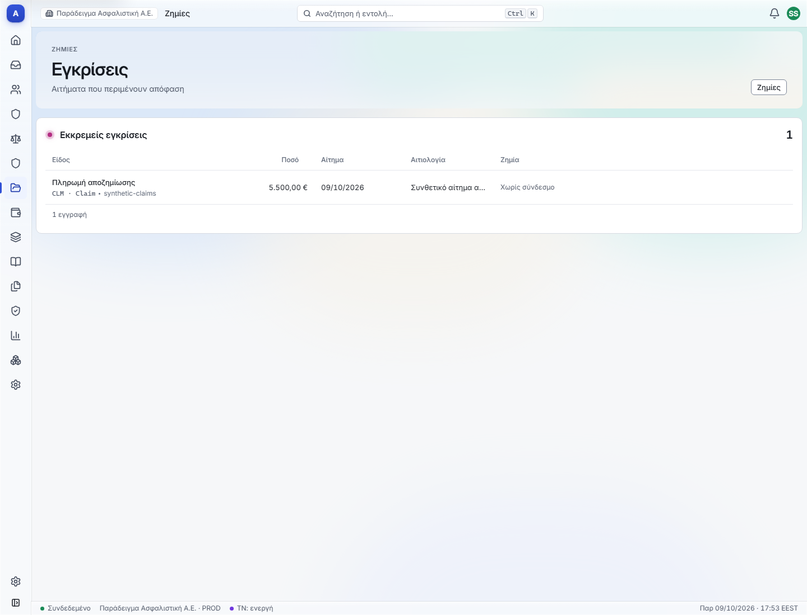
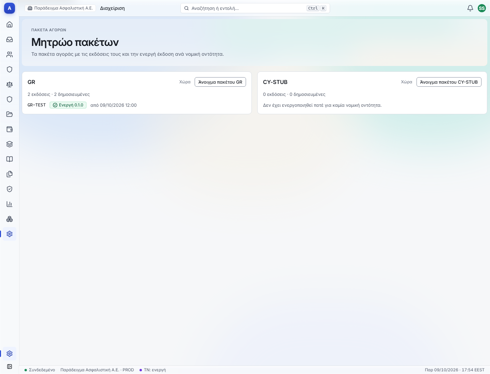
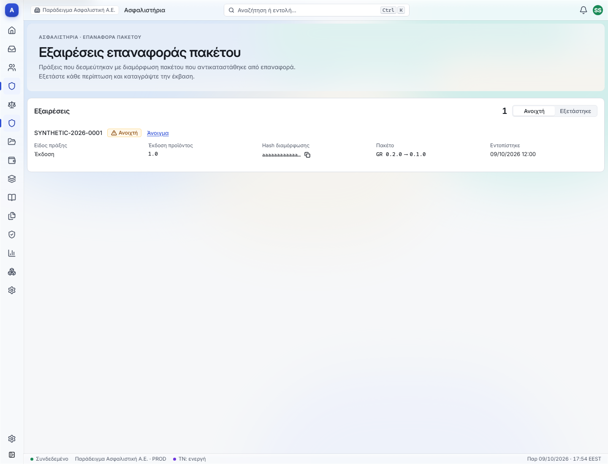
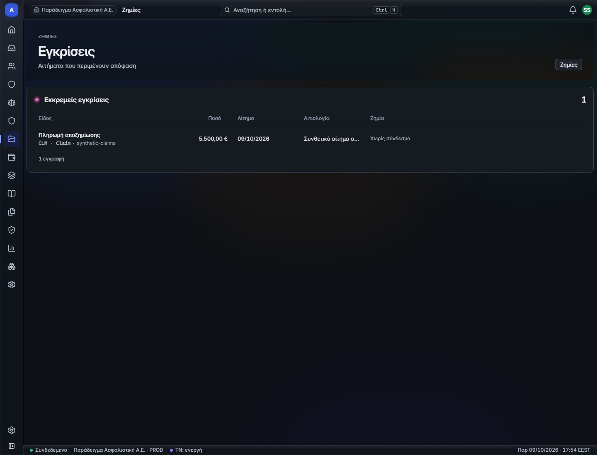
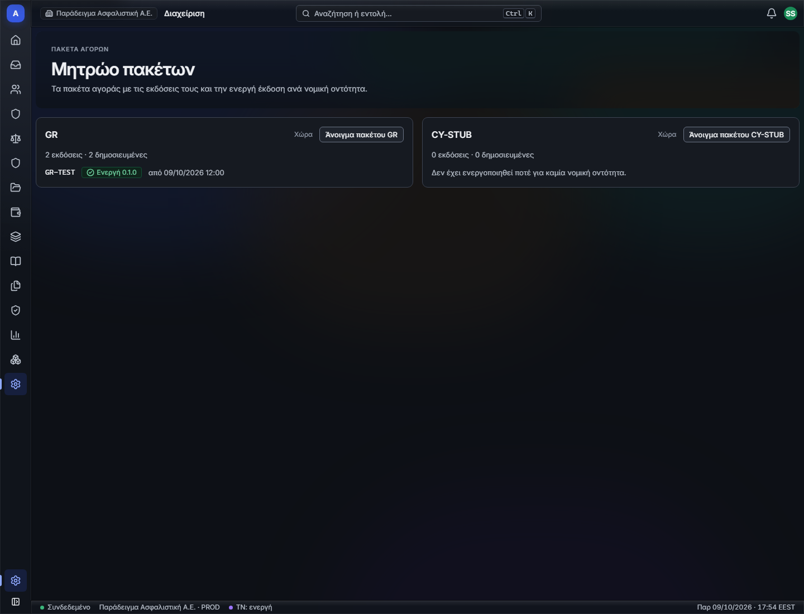
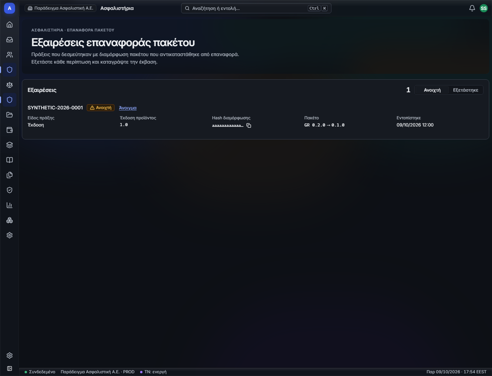
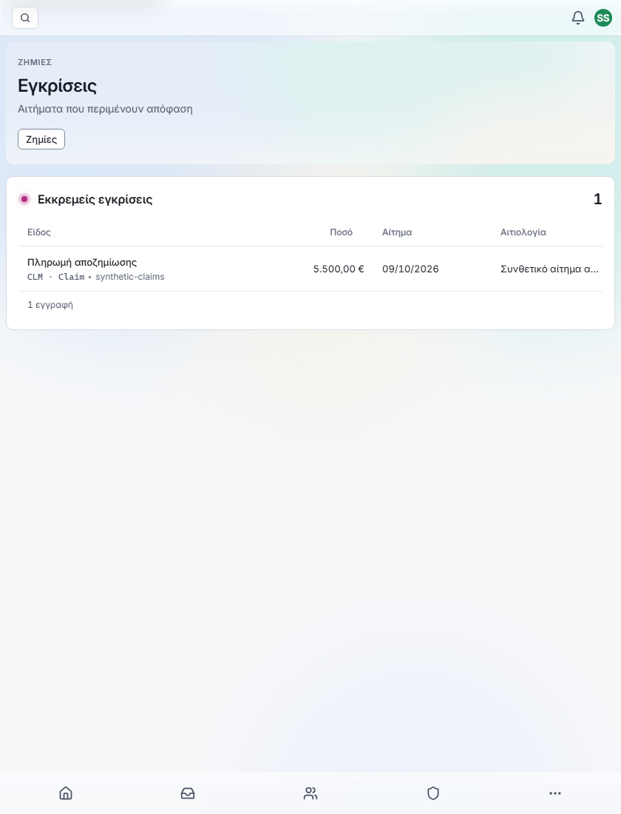
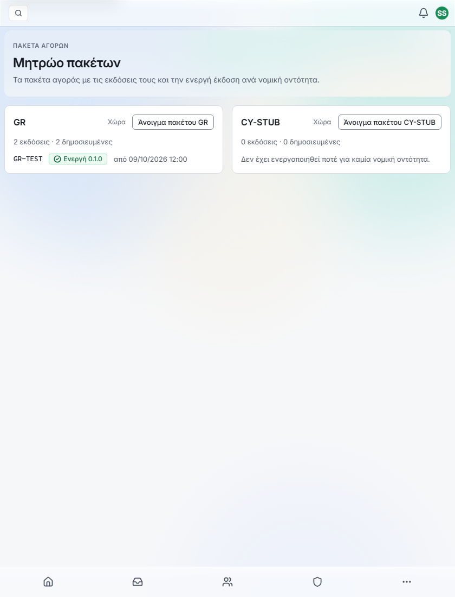
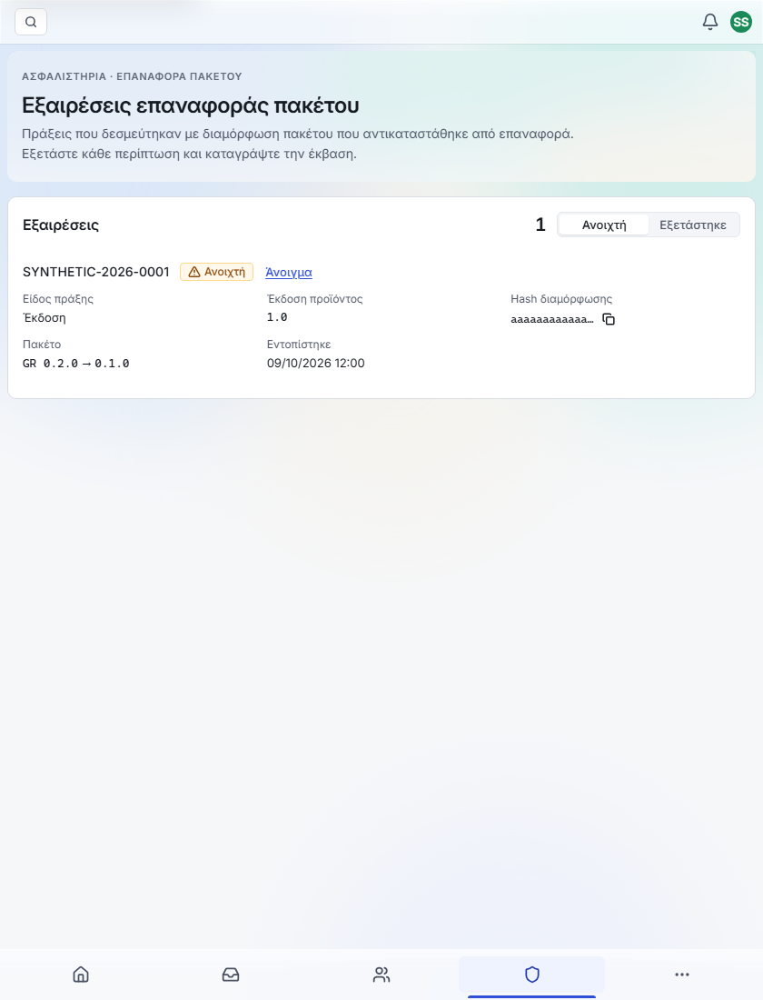

# Pack UI fixture evidence

These are synthetic API/dev-session fixtures rendered through the actual app routes and isolated Vite port 5397. They do not establish native MKT activation/rollback, approval, configuration history or POL rollback-exception behavior. Those APIs are dependencies. No production fake was registered and no user Docker stack was changed. The isolated server has been stopped.

Thirty Greek PNGs cover the claims inbox reference, pack registry/detail/history, rollback dry-run preview, checker page, exception queue/detail/review in light/dark at 1440px and light at 840px. Detail/preview bottom captures supplement the first viewport. All routes rendered without page errors or document overflow. Producer inspected the preview at 1440, checker in dark and queue at 840; independent visual acceptance remains a reviewer task. The warning label describes the old version's activation as undone, rather than implying that version was restored.

| Variant | Existing claims inbox pattern | Pack registry | Exception queue |
|---|---|---|---|
| Light 1440 |  |  |  |
| Dark 1440 |  |  |  |
| Light 840 |  |  |  |

Reproduce with the e2e Playwright dependencies installed, the web dev server running on isolated port 5397, and `node orchestration/ux/sl5-ui-packs/codex-review/capture.mjs`. `PACK_VISUAL_FILTER=pack-detail,rollback-preview` restricts recapture to those screens. The fixture session has several illustrative roles for presentation; it is not native authorization evidence.

